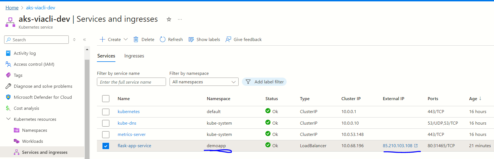
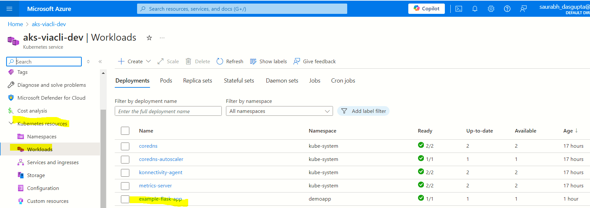
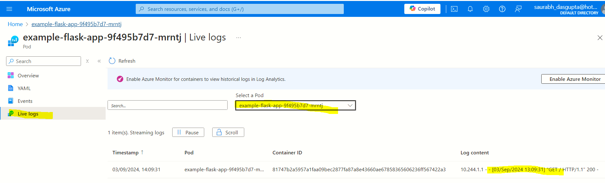

[[_TOC_]]

# My lessons on Azure AKS


# 101-deploy-aks
In this section we deploy an AKS using the simplest possible Azure CLI commands and do some experiments using `Kubectl` and `KubeLogin`.


# 200-create-namespace

## How to create a namespace ?

Look at the YAML here. This just has the name spaces
https://github.com/Azure/kubernetes-hackfest/blob/master/labs/create-aks-cluster/README.md

```powershell
kubectl apply --filename $PSScriptRoot/namespaces.yaml
```

and also read this

https://cloud.google.com/blog/products/containers-kubernetes/kubernetes-best-practices-organizing-with-namespaces


## How to delete a namespace ?

```
kubectl delete namespaces uat
```

## How to get all namespaces ?

```
kubectl get namespace
```

Example output:
```
NAME                   STATUS   AGE
thisnamespace            Active   353d
thatnamespace            Active   586d
```

## Good article on understanding deployment YAML structure

https://www.mirantis.com/blog/introduction-to-yaml-creating-a-kubernetes-deployment#basics


## Creating Pods in the namespace

https://cloud.google.com/blog/products/containers-kubernetes/kubernetes-best-practices-organizing-with-namespaces

```powershell
kubectl apply --filename $PSScriptRoot/pod.yaml --namespace=demoapp
```

```
kubectl get pods
```

## How to know the pods in a namespace 

```
kubectl get pods --namespace ingress-nginx
```

Example output:
```
NAME                                              READY   STATUS                   RESTARTS        AGE
trading-lse-receiver-123a7f754d-v8tzl             1/1     Running                  0               38d
trading-nys-receiver-1234dd74d-8ng9k              1/1     Running                  0               16h
```

https://spacelift.io/blog/kubernetes-namespaces


## See details of a namespace

```
kubectl describe namespace mynamespace
```

Sample output:
```
Name:         mynamespace
Labels:       kubernetes.io/metadata.name=mynamespace
              name=mynamespace
Annotations:  <none>
Status:       Active
```

## Show resource usage of pods in a namespace

```
kubectl top pod --namespace=ingress-nginx
```

## Show all services 

```
kubectl get service
```

Sample output

```
NAME                        TYPE        CLUSTER-IP     EXTERNAL-IP   PORT(S)   AGE
kubernetes                  ClusterIP   10.0.0.1       <none>        443/TCP   662d
trading-app-lse-consumer        ClusterIP   10.0.42.48     <none>        80/TCP    573d
trading-app-nys-mapper          ClusterIP   10.0.65.152    <none>        80/TCP    592d
```

## Get services under a namespace

```
kubectl get service --namespace mynamespace001
```

## Get deployments under a namespace

```
kubectl get deployment --namespace mynamespace001
```

Sample output:
```
NAME                          READY   UP-TO-DATE   AVAILABLE   AGE
trading-app-nys-consumer          1/1     1            1           459d
trading-app-lse-broker            0/0     0            0           300d
```

## Get the YAML of a service

```
kubectl get service myservice --output yaml
```

## Get the YAML of a deployment

```
kubectl get deployment mydeployment001 --namespace mynamespace001 --output yaml
```


## MS Tutorial
I was trying to follow this MS tutorial, but found it difficult. Very large YAML!
- https://learn.microsoft.com/en-us/azure/aks/tutorial-kubernetes-prepare-app?tabs=azure-cli#before-you-begin
- https://github.com/Azure-Samples/aks-store-demo


---

# 300-Deploy-web-app
In this lab we will deply a simple Flask web app.

## Where is the code for the web app ?

[app.py](demo-flask-app/src/app.py)


## Understanding the YAML files

We need the following
- deployment YAML (has the container image name, environment variables)
- service YAML (has the outer ports, load balancer)

The `selector/matchLabels` element must point to the name of the pod through `name: mypod`

## Good samples on YAML
Explains the nuances of selector labels
https://spacelift.io/blog/kubernetes-deployment-yaml


## Getting the external IP address



## View the logs






## Image pull policy

### No policy specified
I updated the image , the tag remained unchanged. I did the AKS deployment. 
**Outcome** - The new image was not picked up.

### Always

If I were to simply push a modified image (with same tag) then AKS does not update itself. However, if run the following command, then AKS does pull the new image
```
kubectl rollout restart deployment example-flask-app --namespace demoapp
```
In the above example, the name of the deployment can be obtained from the following command:

```
kubectl get deployments --namespace demoapp
```

---

# 400-Deploy a job

## What is a Job in Kubernetes ?
Jobs represent one-off tasks that run to completion and then stop. See [Kubernetes documentation](https://kubernetes.io/docs/concepts/workloads/controllers/job/#completion-mode).

## Where is the source code ?
[sourc code](demo-job/src/main.py)


## How to get a list of jobs in a namespace ?

```
kubectl get jobs  --namespace demoapp
```


## Lessons learnt

- Kubernetes has Jobs and ChronJob
- The `restartPolicy` of a job can be `Never` or `OnFailure`
- The `backoffLimit` specifies the number of retries before a job is considered a failure.

## How to restart a job ?

You need this to kick start a job
```
kubectl delete job example-python-job --namespace demoapp
kubectl apply -f job.yaml
```

## How to view the logs ?

```
kubectl logs YOUR_POD_NAME --namespace demoapp
# The YOUR_POD_NAME is the output from kubectl get pods
```

## Further reading

https://medium.com/google-cloud/kubernetes-running-background-tasks-with-batch-jobs-56482fbc853


---

# 500-Chron job

## Azure portal does not show up the cron job
This could be because of the ephemeral nature of a container. It dies off immediately after the job is done.

## How to override the CMD of the Dockerfile ?
Specify the `commmand` element in the YAML of the cron job deployment

```
command: [ "python", "src/chronmain.py" ]
```

## How to view all cron jobs ?

```
kubectl get cronjobs --namespace demoapp
```

Example output:

```
NAME            SCHEDULE      SUSPEND   ACTIVE   LAST SCHEDULE   AGE
demo-cron-job   */2 * * * *   False     0        33s             28m
```

## How to view the logs ?

**Step-1**-Get the list of cron jobs 

```
kubectl get jobs --namespace demoapp
```

Example output:
```
NAME                     COMPLETIONS   DURATION   AGE
demo-cron-job-28758896   1/1           3s         5m43s
demo-cron-job-28758898   1/1           3s         3m43s
demo-cron-job-28758900   1/1           3s         103s
```

**Step-2**-Fetch the logs for the specified instance

```
kubectl logs job/demo-cron-job-28758900 --namespace demoapp
```
Example output:

```
Begin
Current time is 2024-09-05 11:00:01.077809
End
```

## Delete a Cron job

```
kubectl delete cronjobs demo-cron-job --namespace demoapp
```

Example output:

```
cronjob.batch "demo-cron-job" deleted
```

---

# 600-internal-http-communication

## Objective
A python worker which talks to an internal python Flask web app


## How to get the IP address of a web app ?


Get all services
```
kubectl get svc --namespace demoapp
```

Sample output:
```
NAME                                TYPE        CLUSTER-IP     EXTERNAL-IP   PORT(S)   AGE
flask-app-service                ClusterIP   10.0.45.201    <none>        80/TCP    461d
some-other-service               ClusterIP   10.0.143.254   <none>        80/TCP    454d
```

Get specific service
```
kubectl get svc flask-app-service

# Can use -o json option as well
```

Sample output:

```
NAME              TYPE        CLUSTER-IP     EXTERNAL-IP   PORT(S)   AGE
flask-app-service   ClusterIP   10.0.226.215   <none>        80/TCP    462d
```

The `CLUSTER-IP` and the `PORT` combination gives us the complete end point

## Using the internal FQDN

If a service with the name `my-web-app` is deployed to the namespace `my-demo-app` then the internal hostname is `my-web-app.my-demo-app.svc.cluster.local`

### Step-1-Get the pod name

```
kubectl get pods --namespace demoapp
```

### Step-2-Open a remote shell into the pod

```
kubectl exec -it POD_NAME --namespace demoapp sh
```

### Step-3-Run the ping command

```
ping SERVICE_NAME.NAMESPACE.svc.cluster.local
```

### Step-4-Run the Python Socket to connect

The docker image does not have the `ping` utility. Hence taking the longer route via `socket` client connection. Run `pyhon` within the `sh` of the pod to bring up the Python shell and then type the following commands:

```
import socket
s=socket.socket(socket.AF_INET, socket.SOCK_STREAM)
s.connect(("SERVICENAME.NAMESPACE.svc.cluster.local",80))
```

### Step-5-Putting it all together

We have added an environment variable to the deployment YAML of the web client job

```yaml
        env:
        - name: MYWEBAPP
          value: "http://flask-app-service.demoapp.svc.cluster.local/"

```
---

# 700-memcached

## Overview
- We will deploy the official docker image **memcached** to the AKS cluster
- We will have a cron job that will write some data to the cache every N minutes
- We will have a Flask web page that will read the contents from the cache

## How to deploy ?
- Run the script `buildimage.ps1`  to ensure that both the flask web app and cron job images are pushed
- Deploy to Kubernetes by running the script `aksdeploy.ps1`

## How to test the deployment ?
- Verify that the memcached pod has been deployed by running `kubectl.exe get pods --namespace demoapp`
- Verify that the memcached service has been deployed by running `kubectl.exe get service --namespace demoapp`
- Verify that the cron job for writing to memcached has been deployed by runing `kubectl.exe get jobs --namespace demoapp`
- Verify from the logs of the cron job is able to access the memcached service by viewing the logs of the `demo-cron-job-memcachedwriter` pod
- Access the public ip of the `flask-app-service` service and then hit the `/memcached` page to see the most recent payload in the memcached service that was pushed by the `demo-cron-job-memcachedwriter` job

## How to run memcached locally during development ?

You will need this for testing the Python script that writes the payload to memcached and the Flask web app that reads from memcached

### Pull the image
```
docker pull memcached:latest
```

### Run the image

The `-vv` option will display get/set activity on the console

```
docker run --name mymemcached -p 11211:11211 --rm memcached:latest -vv
```

### Verify that the container is running
```
docker ps
```
Expected output:
```
CONTAINER ID   IMAGE              COMMAND                  CREATED          STATUS          PORTS                      NAMES
03d8ed4fe72c   memcached:latest   "docker-entrypoint.s…"   28 seconds ago   Up 27 seconds   0.0.0.0:11211->11211/tcp   mymemcached
```

### Run the Python code for setting a key

Expected output on the Docker terminal:

```
<26 server listening (auto-negotiate)
<27 server listening (auto-negotiate)
<28 new auto-negotiating client connection
28: Client using the ascii protocol
<28 set mykey001 0 0 80 noreply
>28 NOREPLY STORED
<28 connection closed.
```

### Terminate the container
Press CTRL+C in the CMD window to kill it

---

# 800-devops

## Objective
A single Devops YAML based pipeline that is made of the following stages
- **Build**-Run the unit tests and push to container registry
- **DEV deploy**-Deploy to DEV AKS
- **PROD deploy**-Deploy to PROD AKS

## Why Helm and why not kubectl apply
Using `kubectl apply` is tedious for the following reasons
1. No easy way to templatize..
1. You will need to invoke `apply` for each and every Kubernetes resource YAML

## How to use the helm creaet option to create a folder with template helm charts ?

```
helm create myfolder001
```
This will create the folder `myfolder00` with 

```
└───myfolder00
    ├───charts
    └───templates
        └───tests
    
```

The files are as follows:

```
C:.
└───myfolder00
    │   .helmignore
    │   Chart.yaml
    │   values.yaml
    │
    ├───charts
    └───templates
        │   deployment.yaml
        │   hpa.yaml
        │   ingress.yaml
        │   NOTES.txt
        │   service.yaml
        │   serviceaccount.yaml
        │   _helpers.tpl
        │
        └───tests
                test-connection.yaml
```

## how to do the templating with helm template command?

Running the following command will replace values in each of the YAML templates in `templates` directory with values in the `myfolder00/values.yaml` file

```
helm template  myfolder00 --values myfolder00\values.yaml
```


## How to use helm install command ?
In the following example the release name is `myaksdemorelease`. For subsequent deployments, we should use `upgrade` and the same release name. This will do the actual deployment on Kubernetes

```
helm install  myaksdemorelease .\helmcharts --namespace demoapp --create-namespace
```

## helm upgrade
```
helm upgrade  myaksdemo .\helmcharts --namespace demoapp --create-namespace
```
- Any subsequent actions done by helm should use the `upgrade` command
- should have the same release name

## Using Azure Devops task to do the helm upgrade

In the following example, the `HelmDeploy` task abstracts away the `uprgade` operation . Take note of the following:
- overriding values using `overrideValues`
- specifying `--create-namespace` for the first execution 
- Specifying the Azure parameters using `azureSubscription`, `azureResourceGroup` and `kubernetesCluster`

```yaml
  - task: HelmDeploy@1
    displayName: 'helm upgrade'
    inputs:
      azureSubscription: ${{ parameters.azserviceconnection }}
      azureResourceGroup: ${{ parameters.aksresourcegroup }}
      kubernetesCluster: ${{ parameters.aksresourcename }}
      namespace: ${{ parameters.aksnamespace}}
      command: upgrade
      chartType: FilePath
      chartPath: 'aks/800-devops/helmcharts'
      releaseName: myaksdemo
      overrideValues: |
        demojobdockertagname=$(DEMOJOBDOCKERTAGNAME)
        demowebappdockertagname=$(DEMOWEBAPPDOCKERTAGNAME)
        acr=$(CONTAINERREGISTRYURL)
        namespace=${{ parameters.aksnamespace}}
      arguments: '--create-namespace'
      valueFile: 'aks/800-devops/helmcharts/values.yaml'
```


## The basics of setting values deep within the template

The following will produce the substituted results on the stdout:

```
helm template .\helmcharts\ --values .\helmcharts\values.yaml --set acr=coolacr --set demojobdockertagname=blahjobtag
```

## Caveat about helm and kubectl

You will need to delete any prior installations done using `kubectl apply`

## Caveat about helm erroring if we change the pod name after the first install

This was when we changed the pod selector labels from `mypod` to `flaskapppod`. 

```
##[error]Error: UPGRADE FAILED: cannot patch "example-flask-app" with kind Deployment: Deployment.apps "example-flask-app" is invalid: spec.selector: Invalid value: v1.LabelSelector{MatchLabels:map[string]string{"name":"flaskapppod"}, MatchExpressions:[]v1.LabelSelectorRequirement(nil)}: field is immutable

```
The solution was to drop the entire namespace using `kubectl delete namespace demoapp`

---


# Getting AKS credentials

## AZ CLI
```
az aks Get-Credentials --resource-group $global:ResourceGroup --name "AKS-DEV-PORTAL"
```
This will download a credential file to the folder `%USERPROFILE%\.kube\config`


## Sample .kube/config file

```yaml
apiVersion: v1
clusters:
- cluster:
    certificate-authority-data: LS0tLS1CRUdJTiBDRVJUSUZJQ0FURS0****wS0EyCi0tLS0tRU5EIENFUlRJRklDQVRFLS0tLS0K
    server: https://aks-dev-portal-dns-xs6owjf7.hcp.uksouth.azmk8s.io:443
  name: AKS-DEV-PORTAL
contexts:
- context:
    cluster: AKS-DEV-PORTAL
    user: clusterUser_RG-AKS-DEMO-001_AKS-DEV-PORTAL
  name: AKS-DEV-PORTAL
current-context: AKS-DEV-PORTAL
kind: Config
preferences: {}
users:
- name: clusterUser_RG-AKS-DEMO-001_AKS-DEV-PORTAL
  user:
    client-certificate-data: LS0tLS1CRUdJTiBDRVJUSU******ORCBDRVJUSUZJQ0FURS0tLS0tCg==
    client-key-data: LS0tLS1CRUdJTiB**********0tLS0K
    token: lu2s*******r

```

---

# KubeLogin

You will need kubelogin for authenticating KubeCtl with AKS

## How to install ?

When working with Azure, there is a specific version that is needed. The following recommended by MS:

```
az aks install-cli
```

## Where does KubeLogin get installed ?

```
$env:USERPROFILE\.azure-kubelogin
```


## Setting the path to KubeConfig

```
$ENV:KUBECONFIG="$env:USERPROFILE\.kube\config"
```

## Converting the Kube config

```
# There are other options besides azurecli. E.g. spn
kubelogin convert-kubeconfig -l azurecli
```

## Getting the namespace

This will open up a browser for authentication:

```
kubectl get namespaces
```

## MS documentation on doing the KubeCtl login sequence
https://learn.microsoft.com/en-us/azure/aks/kubelogin-authentication


---


# KubeCtl

This is the CLI for dealing with Kubernetes

## Where to download ?
https://kubernetes.io/releases/download/#binaries

Note  - this does not have an EXE extension. This is not zipped up. The file comes down read to be executed

## Version check

```
kubectl version

Client Version: v1.28.2
Kustomize Version: v5.0.4-0.20230601165947-6ce0bf390ce3
Server Version: v1.29.7
```

## cluster-info

```
kubectl cluster-info
```


Expected output
```
Kubernetes control plane is running at https://aks-dev-portal-dns-xs6owjf7.hcp.uksouth.azmk8s.io:443
CoreDNS is running at https://aks-dev-portal-dns-xs6owjf7.hcp.uksouth.azmk8s.io:443/api/v1/namespaces/kube-system/services/kube-dns:dns/proxy
Metrics-server is running at https://aks-dev-portal-dns-xs6owjf7.hcp.uksouth.azmk8s.io:443/api/v1/namespaces/kube-system/services/https:metrics-server:/proxy

To further debug and diagnose cluster problems, use 'kubectl cluster-info dump'.
```

---

## cluster-info with dump option

```
kubectl cluster-info dump --output-directory .\kube-dump
```

Expected output
```
root
    -default
    -kube-system
```


## get nodes

```
kubectl get nodes
```
Expected output:
```
NAME                                  STATUS   ROLES    AGE   VERSION
aks-mysystempol-70397340-vmss000000   Ready    <none>   38m   v1.29.7
```

## kubectl config view

```
apiVersion: v1
clusters:
- cluster:
    certificate-authority-data: DATA+OMITTED
    server: https://aks-dev-portal-dns-xs6owjf7.hcp.uksouth.azmk8s.io:443
  name: AKS-DEV-PORTAL
contexts:
- context:
    cluster: AKS-DEV-PORTAL
    user: clusterUser_RG-AKS-DEMO-001_AKS-DEV-PORTAL
  name: AKS-DEV-PORTAL
current-context: AKS-DEV-PORTAL
kind: Config
preferences: {}
users:
- name: clusterUser_RG-AKS-DEMO-001_AKS-DEV-PORTAL
  user:
    client-certificate-data: DATA+OMITTED
    client-key-data: DATA+OMITTED
    token: REDACTED
```

## kubectl config  current-context

```
AKS-DEV-PORTAL
```
# MS Tutorials

- https://learn.microsoft.com/en-us/azure/aks/tutorial-kubernetes-deploy-application?tabs=azure-cli
- https://learn.microsoft.com/en-us/training/modules/aks-deploy-container-app/

# Lessons learnt

## How to use az acr build command ?
This is convenient because we do not need local docker
```
az acr build --registry NAME_OF_ACR --image demo:v1 ABSOLUTE_PATH_TO_FOLDER_WITH_DOCKERFILE
```


## Configuring a Json schema store
I was tyring to get the intellisense sorted for YAML files inside of VSCODE.
I installed Red hat extension,but it did not reflect. Finally, the steps were:
1. Created a `settings.json` inside the `.vscode` folder
1. Added the following to the settings.json:


```json
{
    "yaml.schemas": {
        "Kubernetes": ["*.yaml"],
    },
    "yaml.schemaStore.enable": true
}
```

This SFO was useful:
https://stackoverflow.com/questions/68811153/yaml-support-for-kubernetes-in-vscode


# kubectl create configmap (TO BE DONE)

I wrote this down with a half understanding

## 1-Deploy the first web app

```
kubectl apply -f my-web-app-service.yaml
```

## 2-Get the Cluster IP

```
kubectl get svc my-web-app -o jsonpath='{.spec.clusterIP}'
```

## 3-Create the Config map

```
kubectl create configmap webapp-config --from-literal=WEBAPP_CLUSTERIP=$(kubectl get svc my-web-app -o jsonpath='{.spec.clusterIP}'
```

## Use the ConfigMap

```
apiVersion: apps/v1
kind: Deployment
metadata:
  name: my-job
spec:
  replicas: 1
  template:
    metadata:
      labels:
        app: my-job
    spec:
      containers:
      - name: my-job-container
        image: my-job-image
        env:
        - name: WEBAPP_CLUSTERIP
          valueFrom:
            configMapKeyRef:
              name: webapp-config
              key: WEBAPP_CLUSTERIP

```


# Memcached

https://hub.docker.com/_/memcached

docker pull memcached:1.6-bookworm

## Google guidance on deploying memcache
They are using `helm repo` and `bitnami` image
https://cloud.google.com/kubernetes-engine/docs/tutorials/deploying-memcached-on-kubernetes-engine

## Documentation on memcached parameters
Refer comments in thus [GitHub issue](https://github.com/docker-library/memcached/issues/7). 

## What is helm repo ?

find out

## Why memcached over memcache ?
https://stackoverflow.com/questions/1442411/when-should-i-use-memcache-instead-of-memcached

## Example of docker compose ?

https://stackoverflow.com/questions/47292669/memcached-not-working-in-docker-compose

## Azure Devops Path trigger
Getting the path `exclude` and `include` right under `pr:` element can get complex!

https://learn.microsoft.com/en-us/azure/devops/pipelines/repos/azure-repos-git?view=azure-devops&tabs=yaml

https://learn.microsoft.com/en-us/azure/devops/pipelines/build/triggers?view=azure-devops

See this article by one Julie Ng. Section "Sub-projects must include paths"
https://julie.io/writing/monorepo-pipelines-in-azure-devops/


