[[_TOC_]]

# About this article
I have presented a simple step by step hands on guide to understand **Azure ARM** templates. There is a widely held belief that **Azure ARM** templates are terribly complicated and therefore there is a need for 3rd party solutions. It my humble opinion and hope that at the end of this step-by-step hands on guide I will be able to convince you otherwise.

---

# Prerequisites
- **VS Code** with ARM extensions installed
- PowerShell Core
- Relatively recent version of **Azure CLI** installed and signed in using `az login`
- An active Azure subscription. **Attention!** - Some of the steps here may cost you some Azure money

The philosopy of this guide is to "_use Microsoft's Azure CLI tool and Microsoft's PowerShell and Microsoft's VS Code to take control of Microsoft Azure Cloud_" . Maximize the usage of the tools that the native platform provides and deliver a working solution.

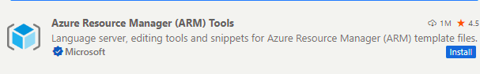

---

# Structure of this tutorial
Every section of this article is prefixed with a number and lab exercises for that section are in a folder which begins with the same numer.


```
    -100-prep-create-resource-group
        |
        |--deploy.ps1
        |
    -200-arm-structure
        |
        |--deploy.ps1
        |
        |--arm.json
        |
    -common
        |
        |--variables.ps1
        |

```

---

# Prepping the resource group

We will need a resource group to contain all the Azure resources we create. For this guide we will confine oursleves to a one and only resource group. The name of this resource group is governed by the variable `$Global:ResourceGroup` in the file `common/variables.ps1`
```powershell
$Global:ResourceGroup="rg-demo-arm-template-experiments"
```

## 101-Creating a basic resource group using the Azure CLI
This is one of the simplest CLI commands
```powershell
& az group create --location $Global:Location --name $Global:ResourceGroup
```

## 102-Creating a resource group using the Azure CLI with tags

Having tags is essential in an enterprise environment. This facilicates the central IT to get a birds eye view  of the dozens/hundreds of applications
```powershell
& az group create --location $Global:Location --name $Global:ResourceGroup --tags department=finance owner=johndoe@cool.com costcenter=eusales
```

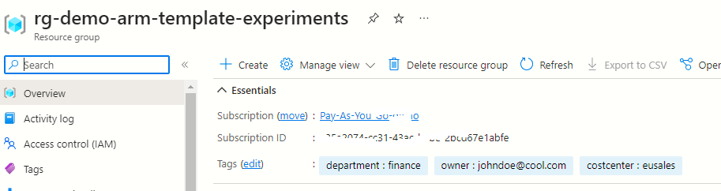

---

# 200-Creating a very basic ARM template structure

**VS Code** enhances the editing experience of ARM templates. Please ensure that you install the following extension:

- Create a new file . Example. **arm.json**
- Type the key word **arm** and you should see the intellisense popping up. Select the option **arm!** and VS Code will fill out the document with the a skeletal ARM structure:
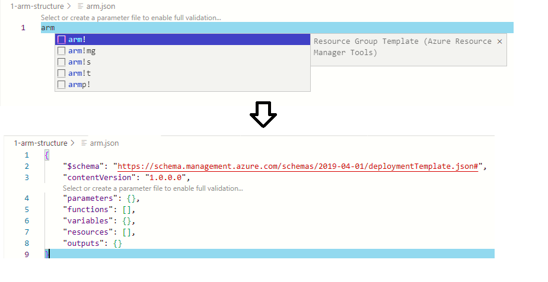

## Understanding the structure 

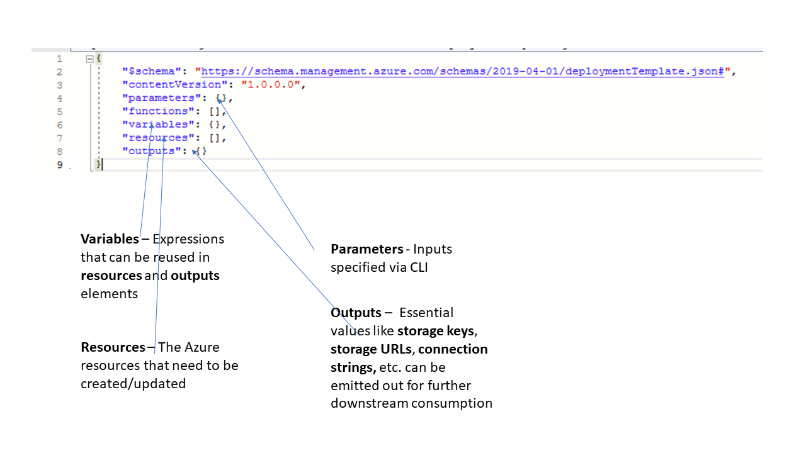

At the very root every ARM template has the 5 elements: **parameters**, **functions**, **variables**, **resources** and **outputs**
```json
{
    "$schema": "https://schema.management.azure.com/schemas/2019-04-01/deploymentTemplate.json#",
    "contentVersion": "1.0.0.0",
    "parameters": {},  //The inputs to the ARM. E.g. Location, Name of the resource , etc. could be passed as parameters
    "functions": [], //Custom functions built out of the of box ARM functions
    "variables": {}, //Additional variables. E.g. you could create a variable that holds a calculated value and is referenced multiple times
    "resources": [], //The actual Azure resources that are geting created
    "outputs": {} //These are values that are programmed to be returned back. These values can be used for subsequent operations. 
}
```


## 200-Azure CLI Command to deploy the ARM template
Let us try and deploy the skeletal ARM template shown above by using the Azure CLI
```powershell
az deployment group create --resource-group $Global:ResourceGroup --template-file $armFilePath  --verbose
```

## What to expect when deploy an ARM template ?
```json
{
  "id": "/subscriptions/635a2074-cc31-43ac-bebe-2bcd67e1abfe/resourceGroups/rg-demo-arm-template-experiments/providers/Microsoft.Resources/deployments/arm",
  "location": null,
  "name": "arm",
  "properties": {
    "correlationId": "191c43f7-8126-4b37-9a9b-b553084db85f",
    "debugSetting": null,
    "dependencies": [],
    "duration": "PT0.2946402S",
    "error": null,
    "mode": "Incremental",
    "onErrorDeployment": null,
    "outputResources": [],
    "outputs": {},
    "parameters": {},
    "parametersLink": null,
    "providers": [],
    "provisioningState": "Succeeded",
    "templateHash": "11635883502557795404",
    "templateLink": null,
    "timestamp": "2023-04-30T22:46:12.610885+00:00",
    "validatedResources": null
  },
  "resourceGroup": "rg-demo-arm-template-experiments",
  "tags": null,
  "type": "Microsoft.Resources/deployments"
}
```


When we deployed our skeletal ARM template, the elements **outputResources** and **outputs** are empty because the elements **resources** and **outputs** of the input ARM file were empty.

---
# 300-Deploy a storage account using just the Azure CLI (no ARM template)

Creating a Storage account is very simple. Just 1 call to the Azure CLI and you are done. No need for an ARM template

```powershell
& az storage account create --resource-group $Global:ResourceGroup --name $Global:StorageAccount --location $Global:Location --sku $Global:StorageAccountSku
```


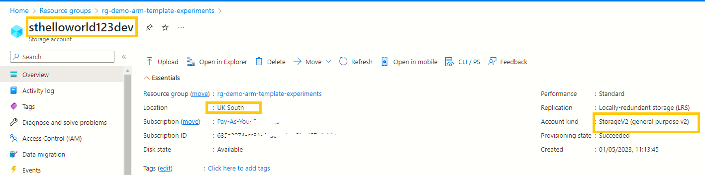

---

# 301-Deploy a storage account using just the Azure CLI and set the tags (no ARM template)

In this example we using the `--tags` option of the Azure CLI to apply the tags on our Storage account. We are not yet using an ARM template.

```powershell
& az storage account create --resource-group $Global:ResourceGroup --name $Global:StorageAccount `
    --location $Global:Location --sku $Global:StorageAccountSku `
    --tags department=$Global:TagDepartment owner=$Global:TagOwner costcenter=$Global:TagCostCenter

```

Notice that we are referencing the same **Global** variables that were used during the resource group creation.

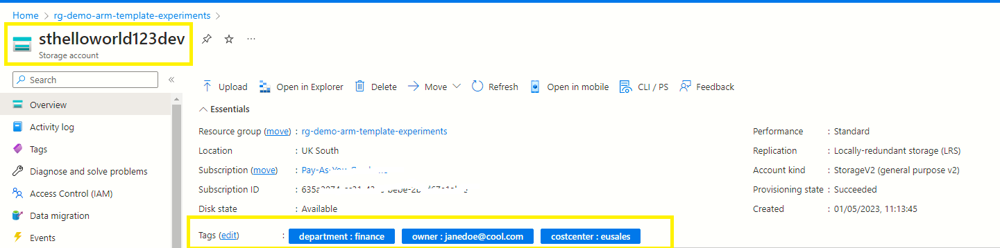

So why bother using ARM templates if Azure CLI does it for you. In the broader picture, using ARM templates can simplify the overall CI/CD by removing redundant parameters and redundant calls to Azure CLI. 

---

# 302-How to grab an ARM template of an Azure resource using the Azure portal

Head over the **Azure portal** and browse to any resource group. Click on the **Create** button to initiate the wizard.

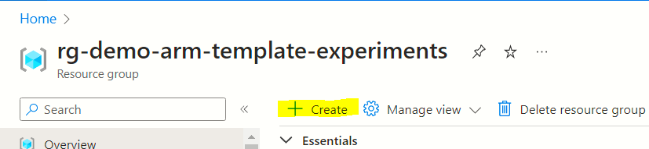

## Page 1
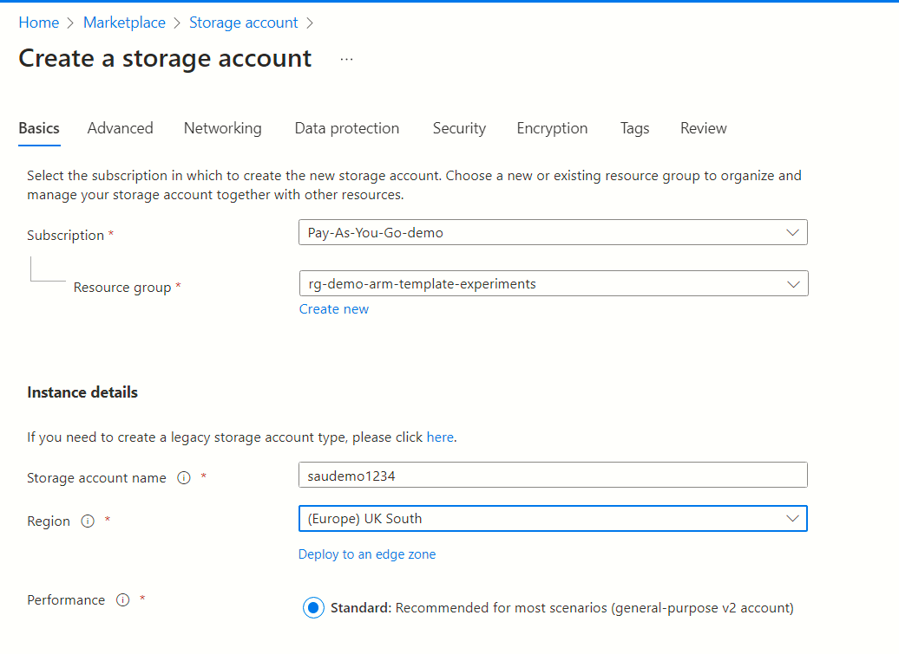

## Page 2
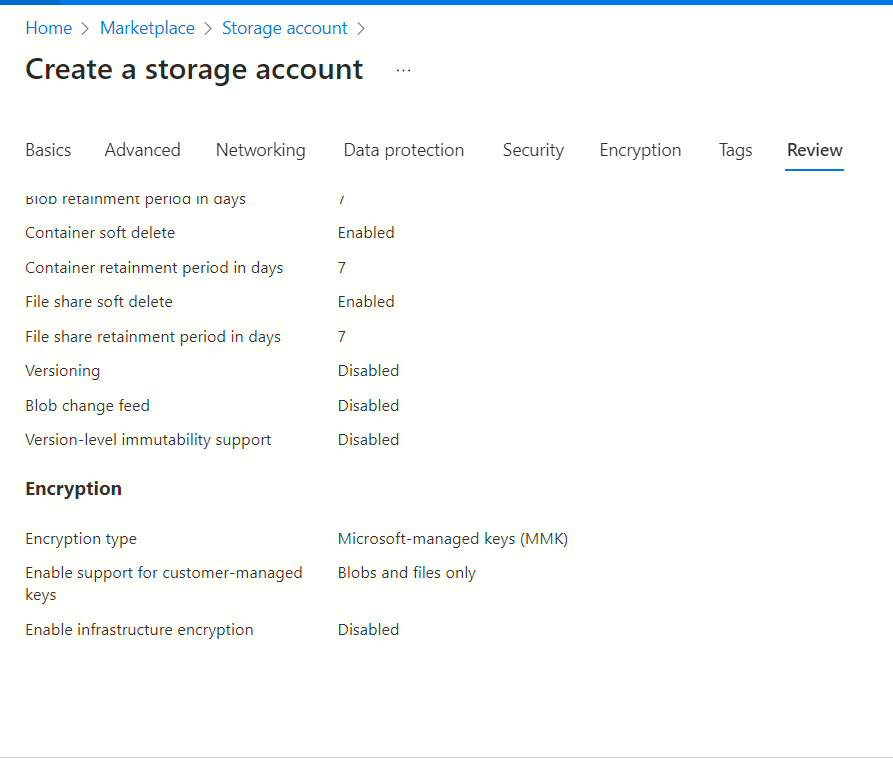

## Page 3
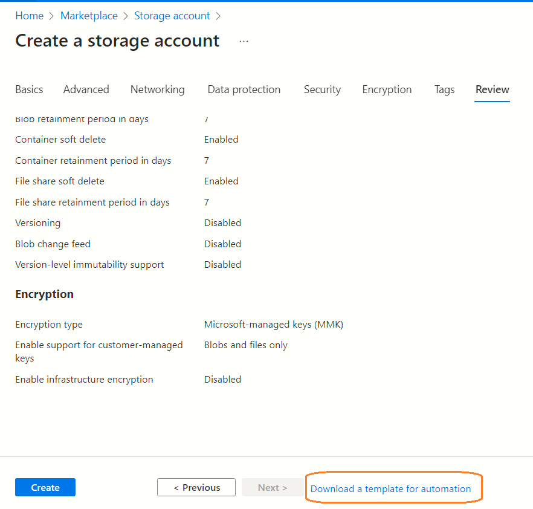

## Page 4
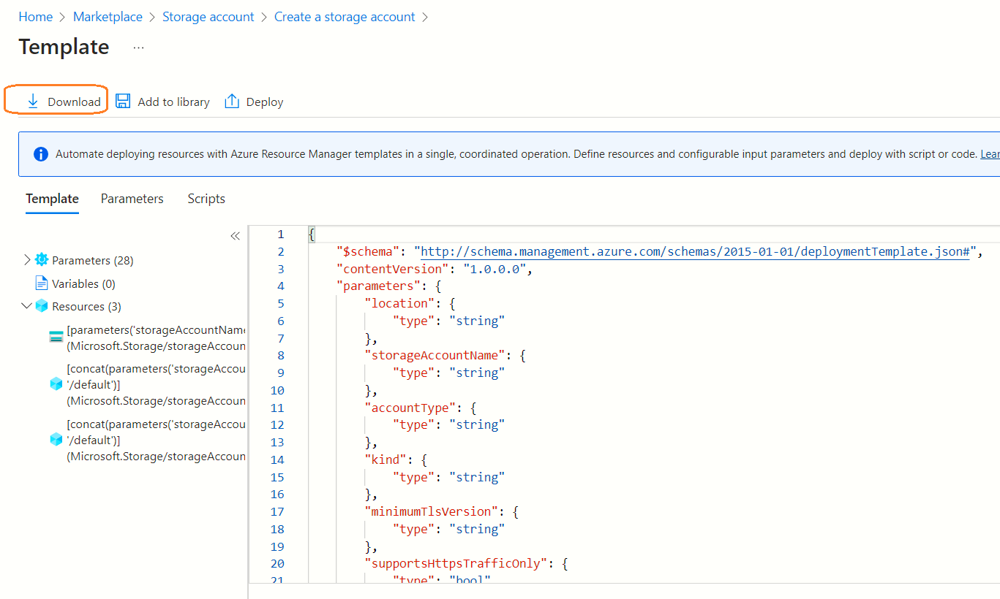

## Page 5
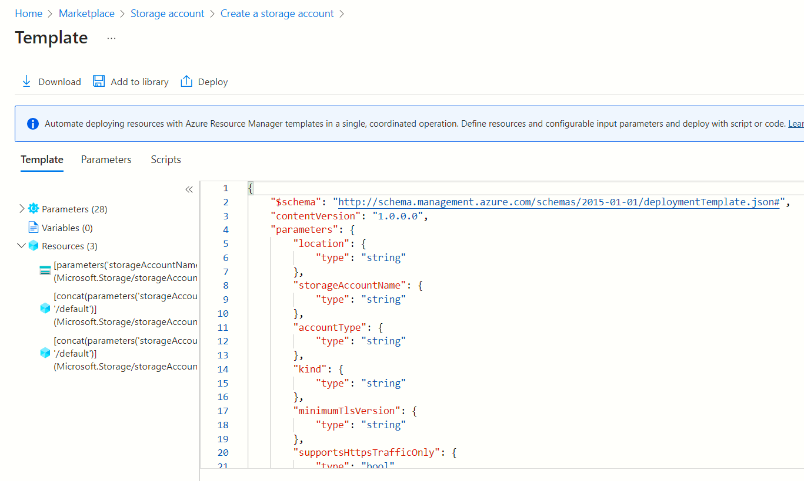


## Understanding the ARM template
[show the parameters, explain some of them, give references to thers ??]


---

# 303-Deploy a storage account using an ARM template (using a parameters file)

All the parameters are specified in the file **parameters.json**. Notice a slight quirk here. The path to the parameter file should be prefixed with the **@** symbol. This is because there are multiple ways to pass parameters when deploying ARM templates via the **Azure CLI**.

```powershell
$armTemplateFile=Join-Path -Path $PSScriptRoot -ChildPath "template.json"
$armParameterFile=Join-Path -Path $PSScriptRoot -ChildPath "parameters.json"

Write-Host "Going to create a storage account '$Global:StorageAccount' using ARM template $armTemplateFile"
& az deployment group create --resource-group $Global:ResourceGroup --template-file $armTemplateFile --parameters @$armParameterFile --verbose

```
---

# 304-Deploy a storage account using an ARM template (location and name as explicit parameters)
We are still using a parameters file but overriding the **storageAccountName** and **location**.  This could be a very useful feature. Consider a scenario where a singe parameter file could serve as a template for all storage accounts involved in your application deployment.


```powershell
$armTemplateFile=Join-Path -Path $PSScriptRoot -ChildPath "template.json"
$armParameterFile=Join-Path -Path $PSScriptRoot -ChildPath "parameters.json"


& az deployment group create --resource-group $Global:ResourceGroup --template-file $armTemplateFile `
    --parameters @$armParameterFile location=westeurope  storageAccountName=section304 `
    --verbose
```
---
# 305-Deploy a storage account using an ARM template (tags referenced from an external JSON file )

In this exercise we want to set the tags of our storage account with name-values stored in an external JSON file.

## Step 1 - New parameter in the ARM template
We define a new parameter in the ARM template which has a type of `object`:

```json
{
"parameters": {
    "tags":{
        "type" : "object"
        }
    }
}
        
```

## Step 2 - New JSON file to store the tags

We create a new file with tags information in JSON format:

```json
{
    "department" :"finance",
    "costcenter": "eusales",
    "owner":"janedoe@cool.com"
}
```

## Step 3 - Instruct Azure CLI to use the tags JSON file

And finally pass the file name as a named parameter to the `Azure CLI`:

```powershell
$armTemplateFile=Join-Path -Path $PSScriptRoot -ChildPath "template.json"
$armParameterFile=Join-Path -Path $PSScriptRoot -ChildPath "parameters.json"
$tagsJsonFile=Join-Path -Path $PSScriptRoot -ChildPath "tags.json"

Write-Host "Going to create a storage account '$Global:StorageAccount' using ARM template $armTemplateFile"
& az deployment group create --resource-group $Global:ResourceGroup --template-file $armTemplateFile `
    --parameters @$armParameterFile storageAccountName=section305 `
    tags=@$tagsJsonFile `
    --verbose
```

---

# 306-Deploy a storage account using an ARM template (location and tags borrowed from the parent resource group)
We know now how to override the parameters of an ARM template. In most of the situations Azure resources might share the same **location** and **tags** as the parent resource group. If I have several resources to deploy in the same resource group then I will have to pass the location and tags for each and every one of them. Can we simplify our code by eliminating this repetition ? This is where built in ARM template functions come in handy.

## The resourceGroup() ARM function

The ARM template is now referencing the `tags` and `location` from the parent resource group

```json
"tags": "[resourceGroup().tags]"
```

```json
"location": "[resourceGroup().location]"
```

## Simplification of the ARM template
The parameters block in the ARM json no longer has the `tags` and `location` elements

## Simplification of the Azure CLI invocation
The `Azure CLI` invocation no longer needs the `location` and `tags` parameters to be supllied explicitly

```powershell
& az deployment group create --resource-group $Global:ResourceGroup --template-file $armTemplateFile `
    --parameters @$armParameterFile storageAccountName=section306 `
    --verbose

```
## ARM template functions reference
https://learn.microsoft.com/en-us/azure/azure-resource-manager/templates/template-functions

---
# 307- Deploy a storage account using an ARM template and output the storage keys
We know how to deploy a storage account. But, we would need the account keys for any downstream application to be able to make a connection (not strictly neccessary if using managed identity). This is where the ARM outputs are useful. 

## The output element

```json
    "outputs": {
        "primaryEndPoints": {
            "type": "object",
            "value":  "[reference(parameters('storageAccountName')).primaryEndPoints]"
          },
        "accountKey": {
            "type": "string",
            "value":  "[listKeys(variables('resourceId'),'2022-09-01').keys[0].value]"
          }        

    }

```

## Result of deployment
```json
    "outputs": {
      "accountKey": {
        "type": "String",
        "value": "WE2RBZqF7EAiY+VO9Es3aQqy9yJrul7svRiwji1oaccNcVWRrF0LYn2cJ1H77B13WKx/Rb02yafb+AStdyK4pA=="
      },
      "primaryEndPoints": {
        "type": "Object",
        "value": {
          "blob": "https://section307.blob.core.windows.net/",
          "dfs": "https://section307.dfs.core.windows.net/",
          "file": "https://section307.file.core.windows.net/",
          "queue": "https://section307.queue.core.windows.net/",
          "table": "https://section307.table.core.windows.net/",
          "web": "https://section307.z33.web.core.windows.net/"
        }
      }
    }
```

## Reference
https://devkimchi.com/2018/01/05/list-of-access-keys-from-output-values-after-arm-template-deployment/

---

# 400-Deploy a key vault using an ARM template

In this example we will deploy an **Azure Key Vault** resource using ARM template. Like beore, I used the Azure portal to generate a skeletal ARM template for me. I removed the `location` and `tenantid` parameters and replaced these with calls to ARM functions.

```json
"location": "[resourceGroup().location]"
```

```json
"tenantId": "[tenant().tenantId]"
```

```powershell
& az deployment group create --resource-group $Global:ResourceGroup --template-file $armTemplateFile `
    --parameters @$armParameterFile `
    name=saudemovault400 `
    --verbose
```
---

# 500-Add the storage account key to Key Vault (using Azure CLI)

## How to retrieve the storage account keys ?
```powershell
(& az storage account keys list --resource-group $Global:ResourceGroup --account-name section307 | ConvertFrom-Json -AsHashTable)
```

Expected output is:
```json
[
  {
    "creationTime": "2023-05-05T22:01:20.152464+00:00",
    "keyName": "key1",
    "permissions": "FULL",
    "value": "WE2RBZqF7EAiY+VO9Es3aQqy9yJrul7svRiwji1oaccNcVWRrF0LYn2cJ1H77B13WKx/Rb02yafb+AStdyK4pA=="
  },
  {
    "creationTime": "2023-05-05T22:01:20.152464+00:00",
    "keyName": "key2",
    "permissions": "FULL",
    "value": "DcUdSKKr9oYkXubaN+FTY/6oiLfSdIhWYpHDOyVklp1RPFFlY6mjlEZBcge40ovou6bn1tEWa82l+AStQrE5ew=="
  }
]
```

## How to set a Key Vault secret ?
```powershell
& az keyvault secret set --vault-name "NAME OF THE KEY VAULT" --name "STORAGEACCOUNTKEY" --value "YOUR STORAGE ACCOUNT KEY"
```

## Putting it all together
```powershell
$VaultName="saudemovault400"
$accountKeys = (& az storage account keys list --resource-group $Global:ResourceGroup --account-name section307 | ConvertFrom-Json -AsHashTable)
$key=$accountKeys[0]["value"]
Write-Host "Going to add the Storage account Key to the key vault $VaultName"
& az keyvault secret set --vault-name $VaultName --name "STORAGEACCOUNTKEY" --value $key
RaiseCliError -message "Failed to set secret in the key vault $VaultName"

```

## How to view the secret value ?
```powershell
az keyvault secret show --vault-name "saudemovault400" --name "STORAGEACCOUNTKEY"
```
---

# 501-Add the storage account key to Key Vault (using ARM templates)

In the previous section we learnt how to fetch the access key of a **Storage Account** using the `az storage account keys list` command and add this secret to the **key vault** by invoking the `az keyvault secret set` command of the Azure CLI. In this section we will explore how to add multiple secrets using a single ARM template deployment

## Skeletal ARM structure for adding key vault secrets

Essential points to keep in mind while adding secrets to the key vault:
- We need to use the resource type `Microsoft.KeyVault/vaults/secrets`
- A single ARM template can have one or more secrets (e.g. StorageAccount, Cosmos, etc.)
- The ARM template deployment will only write the secrets that are referenced in the template. There could be other secrets which were added manually (e.g. the API key of a 3rd party CRM service) - those will remain untouched

```json
        {
        "type": "Microsoft.KeyVault/vaults/secrets",
        "apiVersion": "2021-11-01-preview",
        "name": "[concat( parameters('keyVaultName'),'/', 'STORAGEACCOUNTKEY')]",
        "properties": {
            "value": "[listKeys(resourceId(resourceGroup().name,'Microsoft.Storage/storageAccounts/',parameters('storageAccountName')),'2022-09-01').keys[0].value]"
            }
        }

```

## Deploying the ARM template

In this example, we are executing the ARM template and pasing the name of the key vault as a parameter. **Important** - The secret name in the ARM template should be qualified with the name of the key vault.

[??show a picture of key vault with storage secret and some other secret]

```powershell
& az deployment group create --resource-group $Global:ResourceGroup --template-file $armTemplateFile `
    --parameters  `
    keyVaultName=$VaultName `
    storageAccountName=section307 `
    --verbose

```

## Reference
This is a sample ARM template from 
https://learn.microsoft.com/en-us/azure/key-vault/secrets/quick-create-template?tabs=CLI


---

# your progress is here
- ~~create a storage account with explicit location and tags using the Azure CLI~~
- ~~ARM-Storage-use the location and tags from resource group~~
- ~~ARM-Storage-output the storage key (Very important! Does it even work!)~~
- ~~ARM-Storage-use custom tags from a JSON file~~
- ~~ARM-create a key vault ~~
- ~~ARM how to add secrets to Key vault using CLI, YOU WERE HERE  (Do not use ARM templates, the MS link uses CLI so follow that)~~
- ARM-can we add the storage key directly to the key vault (https://learn.microsoft.com/en-us/azure/key-vault/secrets/quick-create-template?tabs=CLI)
- Web app-round 1
    - POWERSHELL-Create a new variables.ps1 and link with deploy.ps1
    - ARM-app service plan
    - ARM-web app
    - ARM-storage account
    - ARM-key vault
    - Python-hello world code
    - ARM-application insights (optional)
    - ARM-log analytics(optional)
    - Python-logging code using OpenCensus
- Web app-round 2
    - PYTHON-A custom page which reads static text from storage account (some popular text)
- Web app - Flask Basic
    - Hello world page, show current date time
    - No secrets
    - Just plan
    - Just web app
    - A folder with requirements.txt, Dockerfile
- Web app - Flask Advanced
    - simple form to save document to storage account
    - simple form to read from storage account
    - Create App service plan
    - Create web app, pass app settings, raw environment value
    - Create web app, pass app settings, key vault reference
- ??
---

# References
## Azure ARM template reference
https://learn.microsoft.com/en-us/azure/azure-resource-manager/templates/syntax

## Azure ARM template - defining new functions
https://learn.microsoft.com/en-us/azure/azure-resource-manager/templates/syntax#functions

## ARM template functions reference
https://learn.microsoft.com/en-us/azure/azure-resource-manager/templates/template-functions


## How to use listkeys in an ARM template ?
https://devkimchi.com/2018/01/05/list-of-access-keys-from-output-values-after-arm-template-deployment/

## How to use Azure CLI to add key vault secrets ?
https://learn.microsoft.com/en-us/azure/azure-resource-manager/templates/key-vault-parameter?tabs=azure-cli


## Step by step by tutorial from Microsoft
https://learn.microsoft.com/en-us/azure/azure-resource-manager/templates/template-tutorial-create-first-template?tabs=azure-powershell

---
