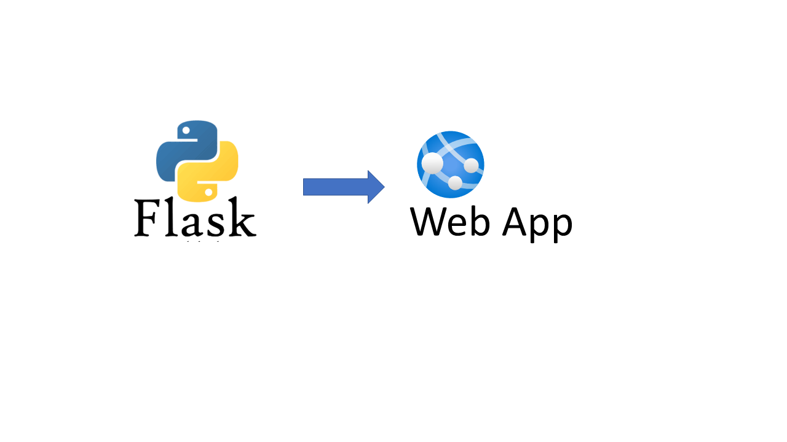
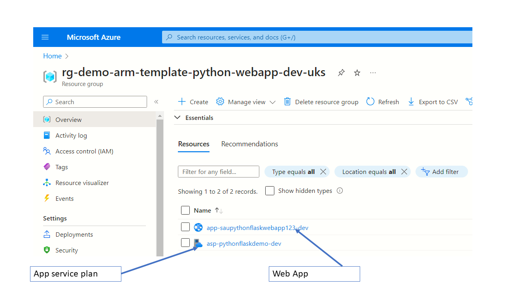

[[_TOC_]]

# Deploy a very simple Python Flask application to an Azure Web App using ARM templates and Azure CLI




# Overview
This is a step by step guide to which demonstrates how easy it is to deploy a simple Python Flask application in just a few easy steps. The primary objective is to create an asset of `Infrastructure as Code` which can be easily automated via `Azure Devops` or any other deployment automation pipelines. 
- Create an Azure `App Service Plan` using ARM template
- Create an Azure `Web App` using ARM template
- Deploy the Python code into the Azure Web app using the Azure CLI

If you are interested to get a quick understanding of `Azure ARM` templates,then I would direct you to my previous article [here](https://medium.com/@saurabh.dasgupta1/azure-arm-template-step-by-step-a78ceba43931)

# Link to source code
The accompanying source code can be found in this [Github repository](https://github.com/sdg002/AzureTrials/tree/main/arm-template-python-flask-webapp). I have used `VS Code` for developing both the Flask app and the PowerShell scripts neccessary to deploy the ARM templates

#### Debugging the Flask App
The folder `400-create-hello-world-flask-app-manually` implements a very basic and a functioning Flask web application. I have followed the [guidance from Microsoft](https://code.visualstudio.com/docs/python/tutorial-flask) to get started with `VS Code` and `Flask`. 

#### Debugging the "Infrastructure as Code"
All IaC should be easily debuggable. With that in mind I have used PowerShell scripts which deploy the ARM template squentially. You will need to have a moderately recent edition of `PowerShell Core` 


# 100-Structure of the code

```
    - azuredevops
        |
        |---docs
        |
        |
        |---400-create-hello-world-flask-app-manually
        |            |
        |            |---app.py
        |            |
        |            |---requirements.txt
        |            |
        |            |---.venv
        |            |
        |
        |
        |---501-create-app-service-plan 
        |            |
        |            |---deploy.ps1
        |            |
        |
        |
        |---502-create-web-app
        |            |
        |            |---deploy.ps1
        |            |
        |
        |---503-deploy-web-app-code
        |            |
        |            |---deploy.ps1
        |            |
        |
        |
        |---504-putting-it-all-together
        |            |
        |            |---deploy.ps1
        |            |
        |
        |
        |---commonvariables.ps1
        |
        |---readme.md
        |

```

# 200-How to be productive with PowerShell and Python in the same repository ?
You could use `PyCharm` or `VS Code` to develop Flask application. Regardless of the choice of IDE, it makes practical sense to keep Python separate from PowerShell.

```
    - azuredevops
        |
        |---docs
        |
        |
        |---400-create-hello-world-flask-app-manually (Launch this folder in VS Code/PyCharm)
        |            |
        |
        |---commonvariables.ps1
        |
        |---readme.md
        |

```
---

# 400-Creating a Hello World Azure Web App manually
I have followed Microsoft's guidelines [here](https://code.visualstudio.com/docs/python/tutorial-flask) to create a very simple `Flask` application using `VS Code`

## Step 1-Create a new folder

When working with Python and VS Code, I find it more convenient to keep the Python sources in a separate tree and have VS Code open that tree exlusively. Therefore, launch a fresh instance of `VS Code` and open the folder `400-create-hello-world-flask-app-manually` . This will be serve as the root folder of our `Hello world` `Flask` app

```
    root
        |
        |
        |
        - 400-create-hello-world-flask-app-manually
        |        |
        |        |--app.py
        |        |
        |        |--requirements.txt
        |        |
        |

```


## Step 3-Create a new VENV
`VS Code` names the virtual env folder as `.venv`


Give this step some time. Say 30 seconds or so. After this, you should new folder `.venv` . This is automatically excluded because of a .gitignore that was automatically created within

## Step 4-Create a requirements.txt
The file requirements.txt will contain all the packages that the App needs. To start with just add the `Flask` package

```
flask
```

## Step-5-Install the packages
Run the following commanf from the Terminal Window of VS Code. 
```PowerShell
.\.venv\Scripts\Activate.ps1
pip install -r .\requirements.txt
```

## Step 4-Create a new file app.py
```python
from flask import Flask
import datetime
app = Flask(__name__)

@app.route("/")
def home():
    return f"<h1>Hello world, Flask on Azure Web App!</h1><hr/>Current clock time is: {datetime.datetime.utcnow()}"

```

## Step 5-Launch the Flask web app
Run the following command from the `Terminal` window of `VS Code`
```powershell
python -m flask run
```


## Microsoft reference
https://code.visualstudio.com/docs/python/tutorial-flask


# 500-Deploying the Hello World Flask Web App to Azure (using ARM templates)

## What are the elements of a Web App on Azure ?
1. **App service plan** - this governs the compute capacity that we are provisioning. A single plan can host multiple web apps
1. **Storage account** - The backing storage behind a web app
1. **Web app** - This is the actual Python web app


## 501-Create a App Service Plan

```powershell
$armTemplateFile=Join-Path -Path $PSScriptRoot -ChildPath "appserviceplan.arm.template.json"
$armParameterFile=Join-Path -Path $PSScriptRoot -ChildPath "appserviceplan.arm.parameters.json"


Write-Host "Going to create App Service Plan $Global:AppServicePlan using ARM template $armTemplateFile"
& az deployment group create --resource-group $Global:ResourceGroup --template-file $armTemplateFile `
    --parameters  @$armParameterFile `
    name=$Global:AppServicePlan `
    --verbose

```

## 502-Create the Web App
I used the Azure portal to help me generate an ARM template for the web app.

```powershell

$armTemplateFile=Join-Path -Path $PSScriptRoot -ChildPath "template.json"
$armParameterFile=Join-Path -Path $PSScriptRoot -ChildPath "parameters.json"


Write-Host "Going to create a web app using ARM template $armTemplateFile"
& az deployment group create --resource-group $Global:ResourceGroup --template-file $armTemplateFile `
    --parameters @$armParameterFile  `
    name=$Global:WebAppName hostingPlanName=$Global:AppServicePlan `
    --verbose
```

## 503-Deploy the Python code to the Web App

We will use the `up` command of the `Azure CLI`. This command can do lots of things at once - something which I am not comfortable with. Example - if left it its devices, this will create the `App Service Plan` and the `App Service` followed by deploying the Python code. Fortunately, the `up` command accepts the prior creation of the plan and web app. 

```powershell
Write-Host "Going to deploy upload Python code to the web app $Global:WebAppName"
$SourceCodeLocaiton = Join-Path -Path $PSScriptRoot -ChildPath "..\400-create-hello-world-flask-app-manually"
Write-Host "The Python code will be deployed from the location $SourceCodeLocaiton"
Push-Location -Path $SourceCodeLocaiton
az webapp up --name $Global:WebAppName
Pop-Location

```

 ## 504-Putting it all togeher
In this exercise we will combine all the ARM templates and deploy them from a single script. We end up with a single `deploy.ps1` which will do the following:

- Apply tags on the resource group
- Deploy the ARM templates from the `templates` sub-folder - one at a time.
- Deploy the Python code using the `az webapp up`  command

```
    - root
        |
        |--deploy.ps1
        |
        |--templates
        |        |
        |        |
        |        |--[template and parameter file for App Service Plan]
        |        |
        |        |--[template and parameter file for Web App]
        |
        |
    

```



---

# References

## Creating a Python Flask App using VS Code
https://code.visualstudio.com/docs/python/tutorial-flask


## Use CI/CD to deploy a Python web app to Azure App Service on Linux
https://learn.microsoft.com/en-us/azure/devops/pipelines/ecosystems/python-webapp?view=azure-devops

## UP command
https://learn.microsoft.com/en-us/cli/azure/webapp?view=azure-cli-latest#az-webapp-up

---

