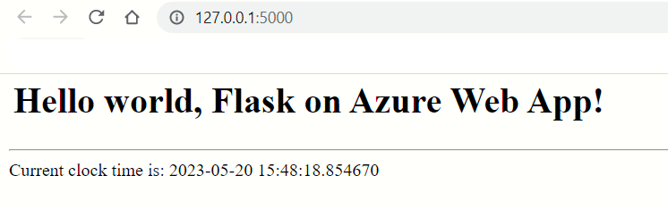

[[_TOC_]]

# Deploy a Python Flask Web app to Azure using ARM templates and Azure CLI

# About
This is a step by step guide to deploy a very simple Python Flask Web app. [??Link to first part of the article on Azure ARM]

# Link to source code
[?? link to the Github repo]

# 100-Structure of the code
[?? you will need to revisit this section , you have moved 501 to under the root level]
```
    - azuredevops
        |
        |--deploy.ps1
        |
        |--cicd.yml
        |
    - webapp-source
        |
        |--app.py
        |
        |--requirements.txt
        |
        |
    - docs
        |
        |--pics
        |

```

# 200-How to be productive with PowerShell and Python in the same repository ?
to be done?? [state the problem. propose the solution - divide and conquer]

# 300-Creating a very simple Python Flask Web App
[No azure here, just a self container hello world Flask app, with one page which shows the time]
Some notes on debugging
??

# 400-Creating a Hello World Azure Web App manually
[?? Talk about what you need to deploy , create a web app manuall and show all the elements]

## Step 1-Create a new folder
```
    root
        |
        |
        |
        - 400-create-hello-world-flask-app-manually
        |        |
        |        |--app.py
        |        |
        |        |--requirements.txt
        |        |
        |

```

## Step 2-Launch VS Code with the new folder
When working with Python and VS Code, I find it more convenient to keep the Python sources in a separate tree and have VS Code open that tree exlusively. Therefore, launch a fresh instance of `VS Code` and open the folder `400-create-hello-world-flask-app-manually` . This will be serve as the root folder of our `Hello world` Flask app


## Step 3-Create a new VENV


Give this step some time. Say 30 seconds or so. After this, you should new folder `.venv` . This is automatically excluded because of a .gitignore that was automatically created within

## Step 4-Create a requirements.txt
The file requirements.txt will contain all the packages that the App needs. To start with just add the `Flask` package

```
flask
```

## Step-5-Install the packages

```PowerShell
pip install -r .\requirements.txt
```

## Step 4-Create a new file app.py
```python
from flask import Flask
import datetime
app = Flask(__name__)

@app.route("/")
def home():
    return f"Hello, Flask! Current clock time is: {datetime.datetime.utcnow()}"

```

## Step 5-Launch the Flask web app
Run the following command from the `Terminal` window of `VS Code`
```powershell
python -m flask run
```




## Microsoft reference
https://code.visualstudio.com/docs/python/tutorial-flask


# 500-Deploying the Hello World Flask Web App to Azure (using ARM templates)

## What are the elements of a Web App on Azure ?
1. **App service plan** - this governs the compute capacity that we are provisioning. A single plan can host multiple web apps
1. **Storage account** - The backing storage behind a web app
1. **Web app** - This is the actual Python web app


## 501-Create a App Service Plan

```powershell
$armTemplateFile=Join-Path -Path $PSScriptRoot -ChildPath "appserviceplan.arm.template.json"
$armParameterFile=Join-Path -Path $PSScriptRoot -ChildPath "appserviceplan.arm.parameters.json"


Write-Host "Going to create App Service Plan $Global:AppServicePlan using ARM template $armTemplateFile"
& az deployment group create --resource-group $Global:ResourceGroup --template-file $armTemplateFile `
    --parameters  @$armParameterFile `
    name=$Global:AppServicePlan `
    --verbose

```

## 502-Create the Web App
I used the Azure portal to help me generate an ARM template for the web app.

```powershell

$armTemplateFile=Join-Path -Path $PSScriptRoot -ChildPath "template.json"
$armParameterFile=Join-Path -Path $PSScriptRoot -ChildPath "parameters.json"


Write-Host "Going to create a web app using ARM template $armTemplateFile"
& az deployment group create --resource-group $Global:ResourceGroup --template-file $armTemplateFile `
    --parameters @$armParameterFile  `
    name=$Global:WebAppName hostingPlanName=$Global:AppServicePlan `
    --verbose
```

## 503-Deploy the Python code to the Web App

We will use the `up` command of the `Azure CLI`. This command can do lots of things at once - something which I am not comfortable with. Example - if left it its devices, this will create the `App Service Plan` and the `App Service` followed by deploying the Python code. Fortunately, the `up` command accepts the prior creation of the plan and web app. 

```powershell
Write-Host "Going to deploy upload Python code to the web app $Global:WebAppName"
$SourceCodeLocaiton = Join-Path -Path $PSScriptRoot -ChildPath "..\400-create-hello-world-flask-app-manually"
Write-Host "The Python code will be deployed from the location $SourceCodeLocaiton"
Push-Location -Path $SourceCodeLocaiton
az webapp up --name $Global:WebAppName
Pop-Location

```

 ## 504-Putting it all togeher
In this exercise we will combine all the ARM templates and deploy them from a single script. We end up with a single `deploy.ps1` which will do the following:

- Apply tags on the resource group
- Deploy the ARM templates from the `templates` sub-folder - one at a time.
- Deploy the Python code using the `az webapp up`  command

```
    - root
        |
        |--deploy.ps1
        |
        |--templates
        |        |
        |        |
        |        |--[template and parameter file for App Service Plan]
        |        |
        |        |--[template and parameter file for Web App]
        |
        |
    

```
---

# References

## Creating a Python Flask App using VS Code
https://code.visualstudio.com/docs/python/tutorial-flask


## Use CI/CD to deploy a Python web app to Azure App Service on Linux
https://learn.microsoft.com/en-us/azure/devops/pipelines/ecosystems/python-webapp?view=azure-devops

## UP command
https://learn.microsoft.com/en-us/cli/azure/webapp?view=azure-cli-latest#az-webapp-up


---

# your progress is here
## Next steps
- Remove the storage account creation from section 500
- Add a 506 - "Putting it all together" which does all the deployment
- 
- New section 600 - Add logging and write some logging code in app.py, log to Terminal window
- 601 - flask app that has logging to Application Insights and 
- 602 Add `Log Analytics` and `Application Insights`
- 603- Add InstrumentationKey to web app settings
- Test if logging works
- 

## Broad ideas

- Web app - Flask Basic without Azure
    - Hello world page, show current date time
    - No secrets
    - Just plan
    - Just web app
    - A folder with requirements.txt, Dockerfile
- Web app-round 1
    - Create resource group
    - POWERSHELL-Create a new variables.ps1 and link with deploy.ps1
    - ARM-app service plan
    - ARM-web app
    - ARM-storage account
    - Python-hello world code
    - Python-logging code using OpenCensus
- Web app-round 2
    - ARM-application insights (optional)
    - ARM-log analytics(optional)
    - PYTHON-A custom page logs the current date and time to Applicaiton Insights
- Web app-round 3
    - ARM-key vault
    - PYTHON-A custom page which reads static text from storage account (some popular text)
- Web app - Flask Advanced
    - simple form to save document to storage account
    - simple form to read from storage account
    - Create App service plan
    - Create web app, pass app settings, raw environment value
    - Create web app, pass app settings, key vault reference
- ??

