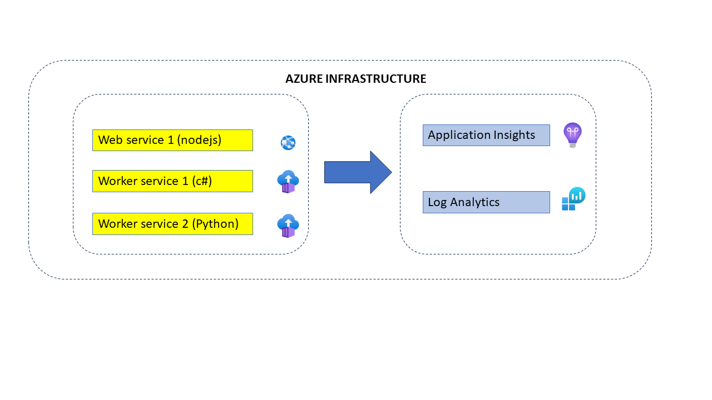
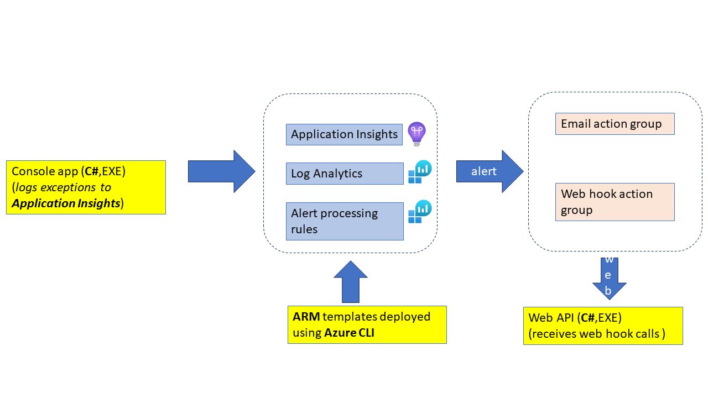
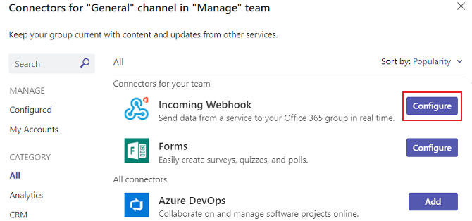
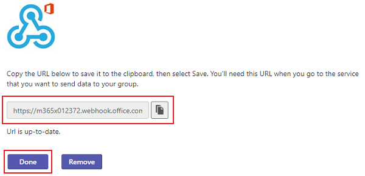
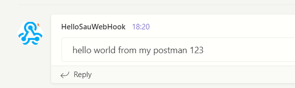

[[_TOC_]]

# TITLE: Deploy Azure Alerts using ARM templates - So easy!
# Overview



Consider a very simple business scenario which comprises of web applications and backend services deployed to Azure. Each of these services log their traces and exceptions to Azure Application Insights. The application is deployed across several environments (DEV, UAT, PROD, etc). You have manually created Azure Monitor Alert rules and action groups. But you are finding it onerous to propage the this part of your infrastructure consistently to all the environments. In this article we will see how simple it is to automate the deployment of Azure Alerts and Action Groups via ARM templates.

The primary objective of my writing this article was to dispel the notion that deploying Azure Alerts via_ Infrastructure as Code_ (IAC) is difficult. On the contrary if you stick to the fundamentals  - Azure automation can be very easy. 

## End goal
One set of templates and PowerShell script that can be deployed across environments

## Intended audience
I firmly believe that "Infrastructure as code" is not the reserve of a full time cloud engineer. Anybody who writes applications should be in a position to script it out. You could be a Python developer who wants to deploy a Flask web application or a NodeJS developer or a C# developer. I wrote this article keeping you in mind.

---

# Link to Source Code

https://github.com/sdg002/AzureTrials/tree/main/azure-alert-msteams-webhook

Structure of the code is as follows
```

│
│
│
├───csharp
│   │
|   ├───webapp <-- Web API to receive calls from Azure alerts
│   │
|   ├───console logger <-- Console EXE  to log sample Exceptions to │   │
App Insights
│
├───devops
│   │
|   ├───variables.ps1  <-- common .PS1 script which contain resource names
│   │
|   ├───create_azure_infrastructure.ps1  <-- .PS1 script to deploy │   │
ARM templates
│   │
│   └───templates  <-- ARM templates
│
└───docs

```
---
# Tutorial on ARM Templates
If you are new to ARM templates then do not worry. Refer my prior article [Azure ARM template - Step by step](https://medium.com/@saurabh.dasgupta1/azure-arm-template-step-by-step-a78ceba43931) on Medium

---

# What to expect from this article ?




## ARM templates to deploy the following
- App service plan
- C# Web app
- Log analytics
- Application Insights
- Azure email action group
- Azure webhook action group
- Azure alert rule which fires if there are more than 0 exceptions in a 5 minute window

A PowerShell script will be used for deploying the above templates

## Console logger (C#) 
This will be used for logging exceptions to Application Insights

## Web App (C#)
A simple C# web app which receives the web call backs from Azure alerting infrastructure


---

# Understanding Azure Alerts and Action Groups
Refer [MS documentation](https://learn.microsoft.com/en-us/azure/azure-monitor/alerts/alerts-overview) on this subject for an indepth discussion.


---
# How to deploy an Azure alert using ARM template ?
Talk about Azure CLI approach and passing parameters. Give an example.
to be done

## Using a parameters file

```powershell
& az deployment group create --resource-group $Global:ResourceGroup --template-file $armTemplateFile `
    --parameters @$armParameterFile  `
    name=$Global:LogAnalytics `
    --verbose
```
## Using a parameters file and additional parameters
You could specify additional parameters via `name=value` pairs

```powershell
& az deployment group create --resource-group $Global:ResourceGroup --template-file $armTemplateFile `
    --parameters @$armParameterFile  `
    name1=value1 name2=value2 `
    name=$Global:LogAnalytics `
    --verbose

```


---

# How to extract the ARM template of action groups ?

## Email Action Group(to be done) ?
- Cheating using the UI (just talk lightly and some screen captures)
- Explain the structure of the ARM template of Action Group
to be done
- Explain what you replaced

---

##  Web hook action group (to be done)?
-Cheating using the UI (just talk lightly and some screen captures)
- Explain the structure of the ARM template of Action Group
- Explain what tags you replaced in the ARM template

---

# How to programmatically send some text to a MS Teams channel  ?

MS Teams provides web hooks as a means of integration with external services

## Configure an incoming web hook
Use the connectors dialog to setup a new web hook



MS Teams will give you an end point:



## Use POSTMAN or any REST client to test the web hook

The REST API protocol is fairly simple:
A JSON payload posted to the above end point:
```json
{
    "text": "hello world from my postman 123"
}
```
will appear on the configured Teams Channel



---

# How to influence the JSON structure of the Azure Alert payload before publishing to a MS teams channels (to be done)?
to be done


---

# How to execute the code (to be done) ?
- Caveat on Azure subscription with billing.
- Visual Studio
- Azure CLI

## Using the console logger to log exceptions to Application Insights ?
Talk about how to set the environment variable **APPLICATIONINSIGHTS_CONNECTION_STRING**


---

# References


## MS documentation on Azure actions for web hooks
https://learn.microsoft.com/en-us/azure/azure-monitor/alerts/alerts-log-webhook


## ARM template - How to reference the instrumentation key in the app settings of Web App ?
Example:
```json
                    "appSettings": [
                        {
                            "name" : "APPLICATIONINSIGHTS_CONNECTION_STRING",
                            "value" : "[reference(resourceId(subscription().subscriptionId, resourceGroup().name,'microsoft.insights/components','name_of_my_appinsightresource'),'2015-05-01').ConnectionString]"
                        }      
                    ]
```

## Custom JSON Payload is no longer supported
https://github.com/MicrosoftDocs/azure-docs/issues/14571

## Reference to ARM template of Alert Web hook
https://learn.microsoft.com/en-us/azure/templates/microsoft.insights/2017-04-01/actiongroups?pivots=deployment-language-arm-template

## StackOverflow - ARM Template parameter is not working for custom payload json  (customWebhookPayload)
https://stackoverflow.com/questions/70439846/arm-template-parameter-is-not-working-for-custom-payload-json

## Github - Parameters in Custom JSON Webhook Action #40167
https://github.com/MicrosoftDocs/azure-docs/issues/40167

## Approach using Run book as a middleware
https://stackoverflow.com/questions/59883257/azure-monitor-alerts-using-webhook-to-microsoft-teams-no-messages-to-teams

## Azure alert sample payloads
https://learn.microsoft.com/en-us/azure/azure-monitor/alerts/alerts-payload-samples


## Github documentation on Azure action group schema
https://github.com/MicrosoftDocs/azure-docs/blob/main/articles/azure-monitor/alerts/alerts-log-webhook.md

## Application Insights alerts no longer have a custom JSON payload option

https://learn.microsoft.com/en-us/answers/questions/800320/application-insights-alerts-no-longer-have-a-custo

## Creating a web hook in MS Teams
https://learn.microsoft.com/en-us/microsoftteams/platform/webhooks-and-connectors/how-to/add-incoming-webhook?tabs=dotnet

---

# Lessons learnt
## How to let Azure know that you are deploying a dotnet core app ?
The parameter  `linuxFxVersion` should be specified. Example: via the parameters file is one of the options
```
    "linuxFxVersion": 
    {
            "value": "DOTNETCORE|7.0"
    }
```

## How to let Azure not initiate a build your Web App code ?

Since we are deploying a dotnet core application, there is no need to do an online build (unlike Python). We should specify SCM_DO_BUILD_DURING_DEPLOYMENT as 0

```
"appSettings": [
    {
        "name" : "SCM_DO_BUILD_DURING_DEPLOYMENT",
        "value" : "0"
    }
]
```

## MS documentation on Azure alerts
https://learn.microsoft.com/en-us/azure/azure-monitor/alerts/alerts-overview

---
