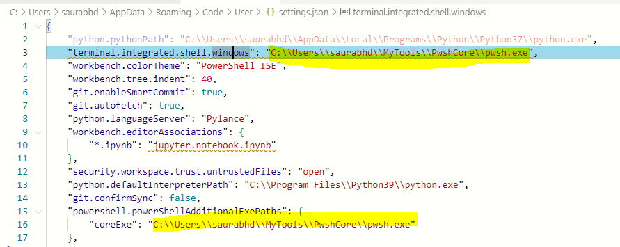
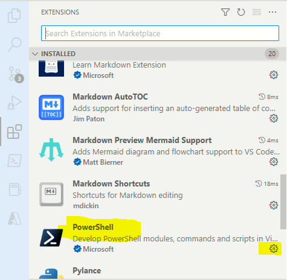
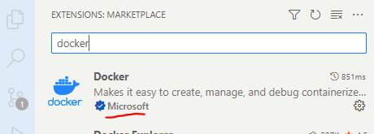
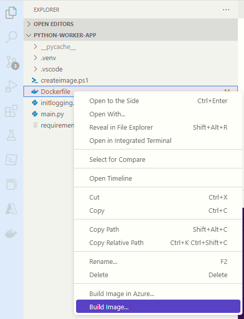
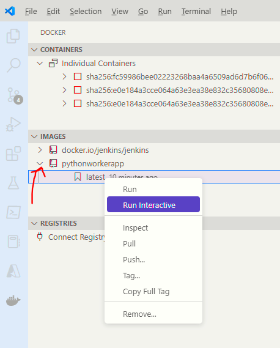

[[_TOC_]]

# Objective
I am trying to experiement with creation of **virtual network** and placing a Virtual Machine on that VNET

# References
## Create a virtual network using Azure CLI
https://learn.microsoft.com/en-us/azure/virtual-network/quick-create-cli#create-virtual-machines

## Getting a list of VM images
```
az vm image list --architecture x64 --location uksouth > .\out\images.json
```

## Getting all supported sizes
```
az vm list-sizes --location $Global:Location  > .\out\vm-sizes.json
```

## Getting all SKUs of a VM

```
az vm list-skus --location uksouth > .\out\vm-skus.json
```

## Difference between stop and deallocate
https://learn.microsoft.com/en-us/answers/questions/574969/whats-the-difference-between-deallocated-and-stopp

## Disallowing public access to a storage account

See the `--public-network-access Disabled` argument in the `az storage account create` command line

https://learn.microsoft.com/en-us/cli/azure/storage/account?view=azure-cli-latest#az-storage-account-create


---


# Fixing PowerShell and VS Code
- I had PWSH installed as a local admin(C:/Program files/PowerShell/)
- I uninstalled and installed the zip to a user level folder
- This caused a problem with VS Code Terminal window

# Step 1 - Let VS Code know the new path of PowerShell Core
- 


# Step 2 - Re-install PowerShell extensions
- You need this extension for debugging PowerShell scripts
- Uninstall and re-install the extension
- Re-start VS Code





# Where was I ?
- Guidance on VM and VNET
- https://learn.microsoft.com/en-us/azure/virtual-network/quick-create-powershell

## What was done
- Create a storage account (done)
- Add to vnet
- You are able to select a VNET
- Disable public access (You want to Enabled from selected virtual networks and IP addresses)
- Create a storage container
- Try connecting to this storage account from outside
- Try connecting to this storage account from inside
- Install Azure CLI on the VM
- Write some script that uploads/downloads data to a storage container
- Test the access of the storage account from the VM (use the test scritp)

## Next steps
- Create with AD access only
- Ask question on Reddit - How to access storage account Find out how to grant access to the storage account from Azure IP addresses (Probably there is nothing at all)
- Write some Python code which can access the storage container
- Test locally as docker image
- Add a Container instance
- Deploy Container to Azure
- Fetch logs
- Add to vnet
- Test with and without VNET


---


# Testing the access to Azure Storage

## Objective
We want to verify that the Network restrictions are indeed working. We will use the accompanying script `test-storage-account.ps1` . 

## Setting the acount key on PowerShell Console
 1. Before executing this script you will need to head over to Azure Portal and grab the Storage Account key
 1. Launch a new Powershell Core console
 1. Navigate to the folder where this repo has been cloned
 1. Launch a PowerShell Console and type the following command
 
```powershell
$env:AZURE_STORAGE_kEY=Get-Clipboard
```


## Running the test script


## With network restrictions in place


## Without any network restrictions
If you allow Public access and run again


---

# Lessons learnt

## Azure CLI will not let you access a storage account with network rules in place
I was under the assumption that **Azure CLI** will let me do everything that **Azure Portal** lets me do. When Public network access is blocked, Azure Portal still allows me to see the Blobs. But the Azure CLI does not permit this.
https://github.com/Azure/azure-cli/issues/18415

## What are the work arounds ?
1. Enable Public Access, wait for 60 seconds and do all operations.
1. Use a hosted Devops agent which is on the same vnet
1. 

---

# Installing Docker extensions in VS Code
Installing the Docker extension in VS Code will simplify Docker management. 

## Which Docker extension to install ?


## How to run Docker build on a Dockler ?


## How to run a Docker image ?


---
