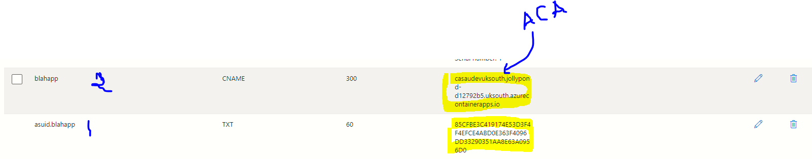

[[_TOC_]]

# About
The manual steps neccessary to 
1. Create a new App Service Domain
1. Attach a public facing Azure Container App to a new domain

---


# How to create a DNS Zone in Azure ?
When an **App Service Domain** resource type is created, an instance of **DNS Zone** type is automatically created.


---

# What domain are we creating when we create an App Service Domain ?
We register a top level domain Example: **sau002.co.uk** . This itself does not point to any specific ip address - but just a top level domain.

This will allow us to create sub-domains under contoso.com which map to various Azure Container Apps. Example: **crm.sau002.co.uk** or **crmdev.sau002.co.uk** or **crmprod.sau002.co.uk**

**Attention** - Once the above resources are created you should be able to run `nslookup sau002.co.uk`


---

# What does an App Service Domain look like ?


---

# What does a DNS Zone look like ?


---


# Step-1-Create a new child domain 'blahapp'




---


# Step-2-Create a new asuid record for 'blahapp'

We need to prove to our DNS registrar (Azure in this case) that we have authority of the targe URL (ACA app in this case). The ACA app provides a digital id (asuid) which should be fed back to the DNS registrar 

**Note** - We create a TXT record with the name **asuid.blahapp** . We have pasted the identity string from the Azure Container App


The indentifier string under the **Value** section comes from the Azure Container App's Domain section.


Verify using **nslookup**
```
nslookup blahapp.co.uk
```

```
C:\Users\saurabhd>nslookup blahapp.sau002.co.uk
Server:  cache1.service.virginmedia.net
Address:  194.168.4.100

Non-authoritative answer:
Name:    casaudevuksouth.jollypond-d12792b5.uksouth.azurecontainerapps.io
Address:  52.151.106.199
Aliases:  blahapp.sau002.co.uk
```


---

# Step-3-Attach the new domain to the Azure Container App


---


# Test-The changes take time to show up
Few minutes.
You can now test by navigating to `blahapp.sau002.co.uk`

---

# ARM templates

## App Service Domain

[See sample](example.appservice.arm.json)


## DNS Zone

[See sample](example.appservicedomain.arm.json)

- See every record is a resource
- See how to pass asuid to the TXT record

