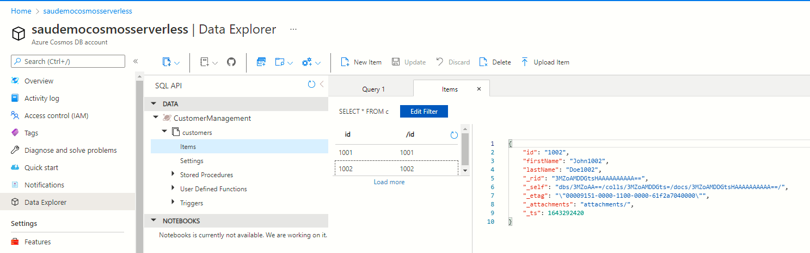

# Overview
Demonstrates how to use *ComosDB* PowerShell module for bulk CRUD operations on Cosmos



# How to install the Powershell module?
```
Install-Module -Scope CurrentUser -Name CosmosDB
```

Sample JSON
```
{
    "id": "1001",
    "firstName": "John1001",
    "lastName": "Doe1001"
}

```

# Accompanying scripts
- DeleteAllRecords.ps1
- PopulateCollection.ps1

# How to run the script?
- Create a Cosmos serverless account
- Create a database and a collection (refer variables in Commosn.ps1)
- Change the variables in *Common.ps1* to point to your Cosmos account
- Clone this repository
- Navigate to the folder which contains this README.MD file
- Run `PopulateCollection.ps`. You should now see 2 documents created
