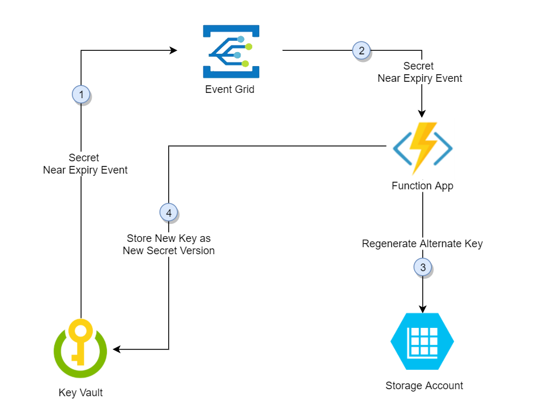
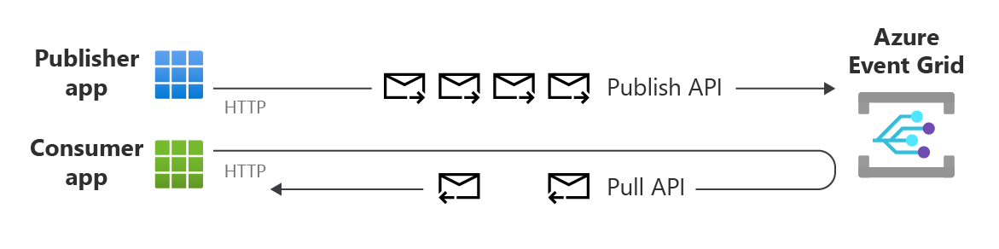

[[_TOC_]]

# Azure event hub key rotation solution

# Objective
?? talk about the problem, talk about key rotation
talk about C# code refreshing its secrets from key vault


# Remove the following (to be done)
```
Set-AzContext -Subscription "Pay-As-You-Go-demo"
```

# Minimum requirements for running the accompanying code (to be done)?

- PoweShell Core
- PowerShell cmdlets
- Visual Studio 2022
- Azure subscription (caveat on pricing)


# About the code (to be done)

## Structure of the code
Show a simple tree like structure of the code and explain what is what


## How to deploy the infrstructure ?
???

## Setting the Azure resource names in variables.ps1 (to be done)
Significance of one and only one `Variables.ps1` file

## Rotate the EventHub connection string and update the key vault

??

## Sampel C# code to fetch configuration from Key Vault
Explain the significance of 

---

# Essential commands and snippets

You were reading this 
https://learn.microsoft.com/en-us/powershell/module/az.eventhub/new-azeventhubkey?view=azps-10.3.0#examples

```
Get-AzEventHubKey -Namespace $Global:EventHubNameSpace -ResourceGroupName $global:ResourceGroup -Name RootManageSharedAccessKey
```

# Getting the primary connection string
```
$keys=Get-AzEventHubKey -Namespace $Global:EventHubNameSpace -ResourceGroupName $global:ResourceGroup -Name RootManageSharedAccessKey


## Getting a secret value from Azure Key Vault (to be done)
???

## ARM template-Adding to key vault via ARM template

```
    {
    "type": "Microsoft.KeyVault/vaults/secrets",
    "apiVersion": "2021-11-01-preview",
    "name": "[concat( parameters('keyVaultName'),'/', 'STORAGEACCOUNTKEY')]",
    "properties": {
        "value": "[listKeys(resourceId(resourceGroup().name,'Microsoft.Storage/storageAccounts/',parameters('storageAccountName')),'2022-09-01').keys[0].value]"
        }
    }

```


---


# Progress

## Done
- You created key vault
- Create event hub via ARM
- Add event hub secret
 
## To be done
- Rotation .PS1
- C# code to poll Key Vault (IConfiguration) and demonstrate that the value changes

---

# Rotate.ps1 (to be done, move this upwards)

Explain about using the variables

Write-Host $keys.PrimaryConnectionString
```
.\rotate.ps1 -rg $Global:ResourceGroup -eventhub $Global:EventHubNameSpace -keyvault $Global:KeyVault -secret "eventhubcnstring"
```

--- 

# Understanding Microsoft's sample PowerShell script  on Key roation

## Link to article

Article

https://learn.microsoft.com/en-us/azure/key-vault/secrets/tutorial-rotation-dual?tabs=azure-cli

## Link to code on Github
Azure function and ARM templates

https://github.com/Azure-Samples/keyvault-rotation-storageaccountkey-powershell

## How does this work ?



There is an event grid subscription to key vault expiration. The 


## Understanding the code ? (to be done)

- show a structure of the PowerShell functions
- show key regeneration
- how does it identify which key to rotate

---

# References

## Stack Overflow 
https://stackoverflow.com/questions/51320268/arm-get-eventhub-namespace-shareacesspolicykey


## MS guidance on accessing Event Hub connection strings
https://github.com/pascalnaber/EnterpriseARMTemplates/blob/6babc4d3e65f10f999bb144a1d616ccb2a085e9d/templates/resources/Microsoft.Eventhub/azuredeploy.json


## MS Guidance on Key rotation solution using Azure function
https://learn.microsoft.com/en-us/azure/key-vault/secrets/tutorial-rotation-dual?tabs=azure-cli


## MS Sample Azure function code to automate the secret rotation
https://github.com/Azure-Samples/KeyVault-Rotation-StorageAccountKey-PowerShell

## MS Article on fetching secrets from C# (not using IConfiguration)
https://learn.microsoft.com/en-us/azure/key-vault/general/tutorial-net-create-vault-azure-web-app
https://learn.microsoft.com/en-us/azure/key-vault/secrets/quick-create-net?tabs=azure-cli

## MS Article on fetching secrets from C# (using IConfiguration approach)
https://learn.microsoft.com/en-us/aspnet/core/security/key-vault-configuration?view=aspnetcore-7.0

## MS warning on deprecation of C# Azure KeyVault  package?
https://www.nuget.org/packages/Microsoft.Extensions.Configuration.AzureKeyVault/

**Warning from Microsoft!**
While this package is still supported, it has been replaced by Azure.Extensions.AspNetCore.Configuration.Secrets per https://github.com/aspnet/Announcements/issues/408.  We recommend using that instead.

## Adding environment variables to C# configuration builder
https://learn.microsoft.com/en-us/dotnet/core/extensions/configuration-providers#environment-variable-configuration-provider

## PowerShell sample to regenerate they key of a Storage Account
https://learn.microsoft.com/en-us/powershell/module/az.eventhub/new-azeventhubkey?view=azps-10.3.0#examples

## Understanding MS Azure Event Grid
https://learn.microsoft.com/en-us/azure/event-grid/overview




## MS Azure Event Grid use cases
https://learn.microsoft.com/en-us/azure/event-grid/overview

You need to download latest Powershell cmdlets. Change of signature


# Adding to key vault via ARM template

```
    {
    "type": "Microsoft.KeyVault/vaults/secrets",
    "apiVersion": "2021-11-01-preview",
    "name": "[concat( parameters('keyVaultName'),'/', 'STORAGEACCOUNTKEY')]",
    "properties": {
        "value": "[listKeys(resourceId(resourceGroup().name,'Microsoft.Storage/storageAccounts/',parameters('storageAccountName')),'2022-09-01').keys[0].value]"
        }
    }

```

# Progress

 # Done
- You created key vault
- Create event hub via ARM
- Add event hub secret
 
 # To be done
- Rotation .PS1
- C# code to poll Key Vault (IConfiguration) and demonstrate that the value changes

---

# Rotate.ps1

```
.\rotate.ps1 -rg $Global:ResourceGroup -eventhub $Global:EventHubNameSpace -keyvault $Global:KeyVault -secret "eventhubcnstring"
```

--- 

# References

## Stack Overflow 
https://stackoverflow.com/questions/51320268/arm-get-eventhub-namespace-shareacesspolicykey


## MS guidance on accessing Event Hub connection strings
https://github.com/pascalnaber/EnterpriseARMTemplates/blob/6babc4d3e65f10f999bb144a1d616ccb2a085e9d/templates/resources/Microsoft.Eventhub/azuredeploy.json


## MS Guidance on Key rotation solution using Azure function
https://learn.microsoft.com/en-us/azure/key-vault/secrets/tutorial-rotation-dual?tabs=azure-cli


## MS Sample Azure function code to automate the secret rotation
https://github.com/Azure-Samples/KeyVault-Rotation-StorageAccountKey-PowerShell

## MS Article on fetching secrets from C# (not using IConfiguration)
https://learn.microsoft.com/en-us/azure/key-vault/general/tutorial-net-create-vault-azure-web-app

## MS Article on fetching secrets from C# (using IConfiguration approach)
https://learn.microsoft.com/en-us/aspnet/core/security/key-vault-configuration?view=aspnetcore-7.0

## MS warning on deprecation of package?
https://www.nuget.org/packages/Microsoft.Extensions.Configuration.AzureKeyVault/

**Warning from Microsoft!**
While this package is still supported, it has been replaced by Azure.Extensions.AspNetCore.Configuration.Secrets per https://github.com/aspnet/Announcements/issues/408.  We recommend using that instead.


---
