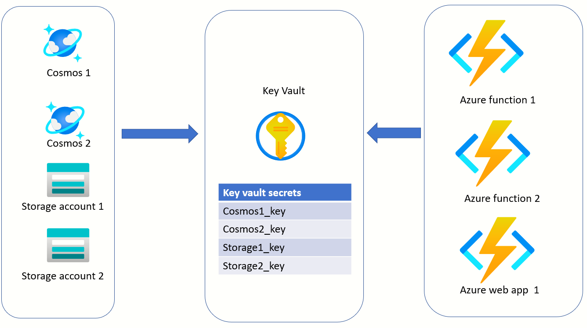
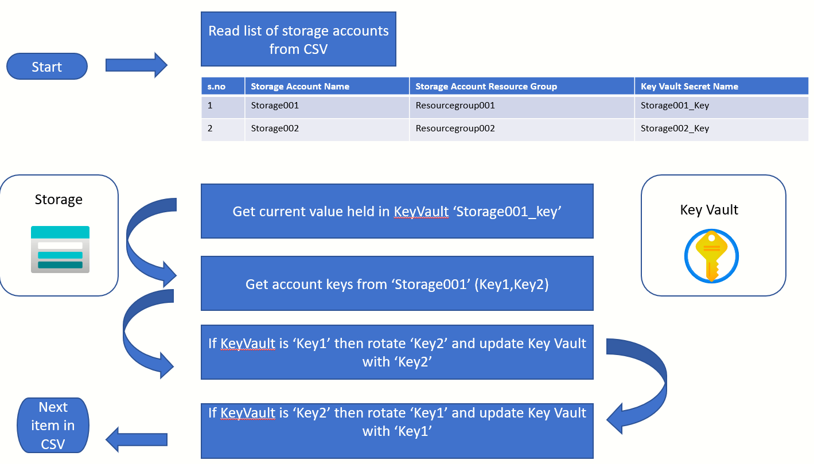
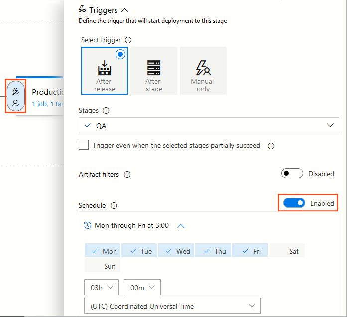

# Implementing a robust Key rotation solution for Azure Storage accounts and Azure Cosmos DB

# Overview
In this short article, I have explained the idea of "Key rotation" in the context of Azure Cloud. 
I have also provided a very simple PowerShell script which when executed, will carry out a rotation of keys (listed in a CSV file) without any application downtime and without the necessity for any code deployments.
To drive my article, I have used Azure Storage Accounts as an example. The approach for Azure Cosmos DB would not be any different.

---

# Securing your Azure storage accounts and Cosmos accounts
Securing an Azure Storge Account or a Cosmos Account can be achieved by one or combination of the following ways:

## Multi Factor Authentication (MFA)
This is a must have from day one. Enable 2 factor authentication for all developers and information workers who are accessing any resources via the Azure Portal. 
This secures Azure Portal from an attacker who might have fraudulently obtained the login/password from one of the employees.
Bear in mind that enabling MFA in itself does not prevent a malicious attack on your Storage account and Cosmos DB account. This is just the first step.

[How it works: Azure AD Multi-Factor Authentication](https://docs.microsoft.com/en-us/azure/active-directory/authentication/concept-mfa-howitworks)


## Virtual Private Network
Implementing MFA is the first big step. But, what happens when an attacker steals the connection strings and keys of Azure Storage accounts and Cosmos DB accounts.
MFA will not prevent an attacker from connecting to Cosmos DB or a Storage account using the fraudulent obtained keys. 
A malware installed on the laptop of the employee could simply screen scrape the connection strings while you browse the Azure portal.

This is why it is important to ring fence your Azure resources using a Virtual Private Network. A VPN provides another layer of protection. 

[VPN security: How VPNs help secure data and control access](https://www.cloudflare.com/en-gb/learning/access-management/vpn-security/)


[About Point-to-Site VPN](https://docs.microsoft.com/en-us/azure/vpn-gateway/point-to-site-about)


[What is a VPN Gateway](https://docs.microsoft.com/en-us/azure/vpn-gateway/vpn-gateway-about-vpngateways)

## Rotation of keys

Implementing a VPN, while the best of solutions, is not trivial. The network topology must be designed to support VPN and network rules must be applied to the Azure Storage accounts and Comos DB accounts so that any access outside of the specified VNETs is prohibited.
Rotation of keys is a fairly straightforward approach. How does it help? 
Regular key rotation significantly limits your company's exposure in the unexpected event that a Storage account or Cosmos DB account key were to fall in the hands of an attacker.

---

# What is the idea behind key rotation?
The workflow is as follows:
- Both Storage accounts and Cosmos DB accounts come with a pair of keys. (Named as Primary/Secondary in case of Cosmos DB, Key1/Key2 in case of Storage account)
- Your application configuration is wired up with the *Primary key* (as an example, could have been *Secondary key*)
- You want to rotate the keys every N days
- Generate a new *Secondary key* by using the Portal/CLI/PowerShell. You selected *Secondary key* because the *Primary key* was active.
- Update the application configuration so that it is now wired up with the *Secondary key*
- Important - You will regenerate the key which is not currently being used by the application configuration. You do not want to disrupt any code which is inflight.
- Repeat steps above during next key rotation

[Manage storage account access keys](https://docs.microsoft.com/en-us/azure/storage/common/storage-account-keys-manage?tabs=azure-portal#protect-your-access-keys)

[Key rotation and regeneration in Cosmos](https://docs.microsoft.com/en-us/azure/cosmos-db/secure-access-to-data?tabs=using-primary-key#primary-keys)

---


# How does the presence of Azure Key Vault simplify key rotation solution?



Azure functions or Azure web apps should be configured to read confidential configuration settings from the key vault.

## Passing configuration without a Key Vault
Setting configuration parameters in this way is perfectly all right for non-sensitive data items. But, when used for sensitive items like connection keys and strings, this leads to proliferation of sensitive data item.
```
databasekey=myCosmos DBkey
```

## The Key Vault way of passing configuration

Microsoft has documented the [following syntax](https://docs.microsoft.com/en-us/azure/app-service/app-service-key-vault-references#reference-syntax) which will make the Azure function to seamlessly pick the confidential information from the Azure Key Vault

```
databasekey=@Microsoft.KeyVault(VaultName=myvault;SecretName=mycosmosdbkey)
```

How does Key Vault help? Azure Key Vault provides another layer of indirection for the Azure function/webapp. With the KeyVault in the mix, you can safely update the Storage account or Cosmos DB account key in the KeyVault.
No need to update the configuration of every Azure function.

---


# How does key rotation work?



---

# PowerShell script for key rotation
The full script can be found in the file **RotateKeys.ps1**. 
In the interest of brevity, I am only presenting a high-level view of the key cmdlets used in this script
```
Start
	|
	|
	|
	Read CSV using Import-Csv
	Columns = StorageAccountName,StorageAccountResourceGroup,KeyVaultSecretName
	|
	|
	Iterate line by line 
	|
	|
	Read existing secret held in KeyVaultSecretName using Get-AzKeyVaultSecret
	|
	|
	Read storage account keys for the account StorageAccountName and StorageAccountResourceGroupName
	using the cmdlet Get-AzStorageAccountKey
	|
	|
	Compare the key held in Key Vault with the 2 storage account keys
	(Pick the one for rotation. This is the key that is not in the Key vault, we do not want to disturb live connections)
	|
	|
	Change the storage account key using the cmdlet New-AzStorageAccountKey
	|
	|
	Continue to next line item in the CSV
	|
	|
End
```

# How to schedule the rotation of the keys?
It is recommended that the script be executed at periodic intervals.
If you are using Azure Devops for your CI/CD then a scheduled trigger can be easily configured.
Microsoft's documentation can be found [here](https://docs.microsoft.com/en-us/azure/devops/pipelines/release/triggers?view=azure-devops#scheduled-release-triggers)


# PowerShell script to create the demo infrastructure
The accompanying script **CreateInfra.ps1** will help in doing a quick demonstration of the main PowerShell script **RotateKeys.p1**
This script will create the following resources:

- New resource group
- New storage account
- New key vault


# Azure PowerShell reference
These snippets are just for reference. I found them valuable while authoring this article.
# Get the keys of a storage account
```
$keys=Get-AzStorageAccountKey -ResourceGroupName $ResourceGroup -Name $DemoAccountName
# Gives the name of the Key1, 'Key1'
$keys[0].KeyName  
# Gives the plain text value of the key
$keys[0].Value

```


## Read a secret from KeyVault
```
Get-AzKeyVaultSecret -VaultName "MyKeyVault" -Name "MyKeyName" -AsPlainText
```

## Get list of all users
```
Get-AzADUser
```


## Get role assignments?
```
#Ensure that $userid is assigned to the Id property of the current user who has logged in
Get-AzRoleAssignment -ObjectId $userid
```

## Key vault access policy
If you want to access the keys in the vault via `Get-AzKeyVaultSecret` then the following is neccessary
```
$PrincipalName="THIS IS THE ACCOUNT WHICH HAS BEEN USED FOR Connect-AzAccount"
Set-AzKeyVaultAccessPolicy -VaultName $KeyVaultName -UserPrincipalName $PrincipalName  -PermissionsToKeys create,import,delete,list,get -PermissionsToSecrets set,delete,get,list -PassThru

```


