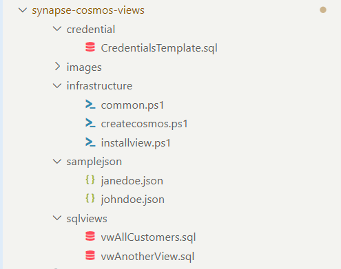
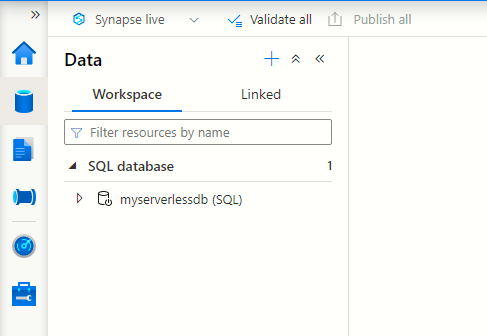
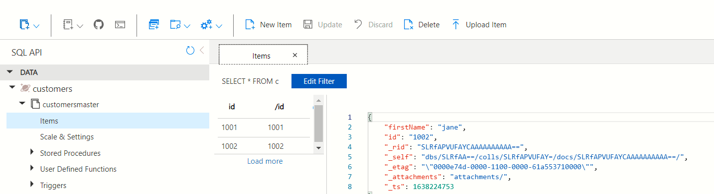

# How to deploy SQL views to a serverless pool of Azure Synapse?
---

# Overview
In this article we demonstrate the basics of the following:
- How to deploy SQL views to an existing instance of **Azure Synapse Studio**.
- This article assumes the presence of a **Azure Synapse Studio** instance. Refer PowerShell scripts in the sibling folder [synapse-workspace-armtemplate](../synapse-workspace-armtemplate) to deploy a new instance.
- This article focusses more on the CI/CD aspects of the deploying SQL views to the serverlss instance of Azure Synapse Studio

# Prerequisites
- A functioning Azure Cloud subscription with full rights
- You will need to create a provisioned instance of Cosmos with Analytical store. This is most likely going to cost you money (PS script provided).
- Windows 10, PowerShell Core. (Not tested on Mac OS , but as per MS, PowerShell core should work)
- Visual Studio Code

# Folder structure



# List of files and accompanying scripts

## credential
SQL file which will be used for creating custom SQL credential objects

## sqlviews
SQL file(s) which will be used for producing flattened data on the data held in Cosmos containers

## infrastructure
Contains the PowerShell scripts
- **createcosmos.ps1** - Creates a new Cosmos account with analytical store enabled and a database with a single container `customersmaster`
- **installview.ps1** - Opens the .SQL files, replaces tokens in the folder **credential** and **sqlviews**
- **common.ps1** - Common variable declarations used by the scripts mentioned above

## samplejson
Toy JSON files should be manually added to Cosmos, so that the SQL views can produce some sensible results

# Quick start
- Deploy an instance of the Azure Synapse using the script available under the folder '**synapse-workspace-armtemplate**' at the very root of this repo.
- Get inside this new Synapse Workspace instance and manually create an instance of a serverless database by the name **myserverlessdb**. The SQL views will be created in this serverless database.

-
- Deploy an instance of Cosmos using the script **createcosmos.ps1**. A new Cosmos account will be created with Analytical Storage enabled.
- The script will also create a new database and a container with the names **customers** and **customermaster** respectively
- Use the Azure Portal to load the Cosmos container with JSON documents from the **samplejson** folder
- 
- Execute the script `installviews.ps` to deploy the SQL views
- Follow the steps under **How to test the Sql Views** to execute the SQL views and examine the results


# How to test the Sql Views?
The PowerShell cmdlet `Invoke-SqlCmd` can be used for invoking the SQL views which were created using **installview.ps1**. Refer following snippet from the accompanying PowerShell script
```
function ExecuteSql([System.Object]$synapseworkspace,[string]$serverlessdatabase,[string]$sql)
{
    $token = (Get-AzAccessToken -ResourceUrl https://database.windows.net).Token
    $cnstring=$synapseworkspace.ConnectivityEndpoints.sqlOnDemand
    $results=Invoke-Sqlcmd -ServerInstance $cnstring -Database $serverlessdatabase -Query $sql -AccessToken $token -Verbose
    return $results
}
```

# MS links
- [How to write a SQL query inside Synapse Worksapce](https://docs.microsoft.com/en-us/azure/synapse-analytics/sql/query-cosmos-db-analytical-store?tabs=openrowset-key)
- PowerShell Cosmos reference **to be done**


# Sample queries on Cosmos analytical store

## Simple query
```
SELECT TOP 10 *
FROM OPENROWSET( 
       'CosmosDB',
       'Account=democosmosquery123;Database=sampledatabase;Key=0q76IU4Bd2b1RVjyx1N2PRWhqqNPDI7KxustUWs93lx3QN9BaJNoL3zAzDNwK37CTqvQ6CN9xBZpZsE7obA5JA==',
       customers)
WITH (  
        id	varchar(8000),
        firstName   varchar(1000)
) AS docs

```

## Simple query with renamed columns
```
SELECT TOP 10 *
FROM OPENROWSET( 
       'CosmosDB',
       'Account=democosmosquery123;Database=sampledatabase;Key=0q76IU4Bd2b1RVjyx1N2PRWhqqNPDI7KxustUWs93lx3QN9BaJNoL3zAzDNwK37CTqvQ6CN9xBZpZsE7obA5JA==',
       customers)
WITH (  
        ID	varchar(8000) '$.id',
        FirstName   varchar(1000) '$.firstName'
) AS docs

```

# SQL to create credential
In the following example, the `SECRET` is the Cosmos account key.
```
CREATE CREDENTIAL MyCosmosDbAccountCredential
WITH IDENTITY = 'SHARED ACCESS SIGNATURE', SECRET = '0q76IU4Bd2b1RVjyx1N2PRWhqqNPDI7KxustUWs93lx3QN9BaJNoL3zAzDNwK37CTqvQ6CN9xBZpZsE7obA5JA==';
```

Achieving the same more defensively

```
IF EXISTS (SELECT * FROM SYS.CREDENTIALS WHERE [name] = 'MyCosmosDbAccountCredential') DROP CREDENTIAL MyCosmosDbAccountCredential
CREATE CREDENTIAL MyCosmosDbAccountCredential
WITH IDENTITY = 'SHARED ACCESS SIGNATURE', SECRET = '0q76IU4Bd2b1RVjyx1N2PRWhqqNPDI7KxustUWs93lx3QN9BaJNoL3zAzDNwK37CTqvQ6CN9xBZpZsE7obA5JA==';
```

# Querying Cosmos by specifying a Credential

```
SELECT TOP 10 *
FROM OPENROWSET( 
       PROVIDER='CosmosDB',
       CONNECTION='Account=democosmosquery123;Database=sampledatabase',
       OBJECT='customers',
       SERVER_CREDENTIAL='MyCosmosDbAccountCredential')
WITH (  
        ID	varchar(8000) '$.id',
        FirstName   varchar(1000) '$.firstName'
) AS docs

```

# Creating a custom SQL View
```
IF EXISTS (SELECT * FROM SYS.OBJECTS WHERE [name] = 'vwCustomers') DROP VIEW vwCustomers
GO

CREATE VIEW vwCustomers 
AS SELECT *
FROM OPENROWSET( 
       PROVIDER='CosmosDB',
       CONNECTION='Account=democosmosquery123;Database=sampledatabase',
       OBJECT='customers',
       SERVER_CREDENTIAL='MyCosmosDbAccountCredential')
WITH (  
        ID	varchar(8000) '$.id',
        FirstName   varchar(1000) '$.firstName'
) AS docs
GO

```


