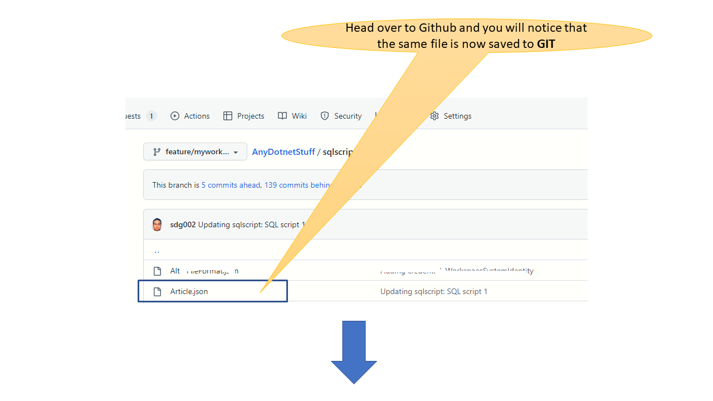
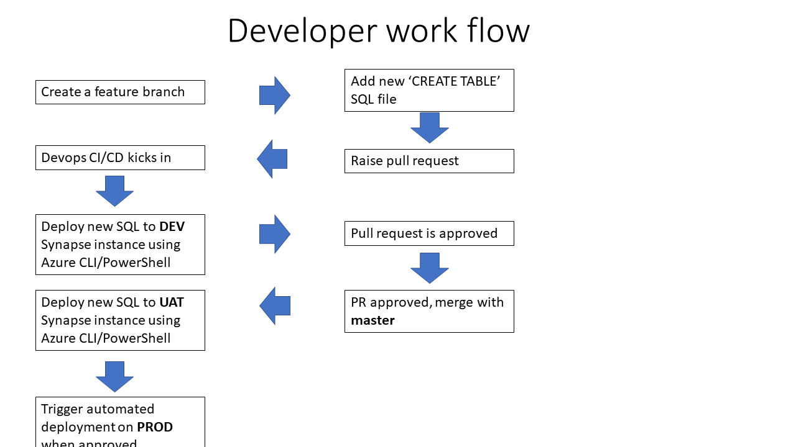

# Azure Synapse Serverless- A better approach to GIT integration and Pull Request reviews using Azure Devops
---


# Overview
**Azure Synapse** is Microsoft's data analytics solution on the cloud that significantly accelerates the time to virtualize and analyze myriad data sources. 
Synapse SQL offers both serverless and dedicated resource models. The serverless model makes it easy for companies to enter the big data space with relatively small monetary comittment. The dedicated pool model allows the company to scale up massively.


In this article we describe an approach to script the deployment of **Azure Synapse Serverless** and all the neccessary SQL artifacts.
This approach was borne out of the neccessity to not only GIT integrate all the PowerShell and SQL scripts that constitute the IAC (infrastructure as code) but also have separate DEV/UAT/PROD environments. Each environment has its own Synapse serverless instance and its own storage accounts, thereby producing complete isolation.  By the end of this article we want to have a solution where we can confidently move Synapse serverless artifacts from **DEV** to **UAT** and to **PROD**.


---
# Hypothetical business scenario
Before we go too far down the road, it is neccessary to pin down business scenario so that we are clear about the problem for which we want a solution.  Consider a company (call it **Contoso**) which receives data feeds in the form of CSV files from several external systems and vendors. These are reports such as:
- stock prices
- cargo movement data
- commodity prices
- freight prices

and gathered from sources and parties scatterred all over the world. Contoso has analysts which want to analyze this vast trove of data and product reports which can translate to meaningful actions.


- Lots of CSV files coming in from varous external parties and sources. 
- A data ingestion framework built on Synapse pipelines. Data is pulled in via web scraping, ftp, http, email scraping
- Each type of CSV has a dedicated container in one central stroage account
- CSV file --> picked up by pipline --> some clearn up/ETL --> dumped into specific storage account based on file name pattern
- We are going to restrict ourselves to CSV for this discussion. Can be extended to parquet
- The company has data scientists and Power BI report writers who want to query on these files using SQL and make sense of market movements


---

# What is not in the scope of this article?
- We are not discussing Synapse data transformation pipelines
- We are restricting to files with CSV format, although solution can be extended to PARQUET and JSON
- We are addressing the CI/CD issues specifically with **serverless** pool. Even though this solution can be extended to **SQL  pool**, SSDT would be more advisable in such situations.
- We are not discussing PySpark or created Spark tables using the Spark pool
 
---

# Prerequisites neccessary to follow this article and run the sample code?
- Access to Azure subscription
- Visual Studio code
- PowerShell Core and the Azure cmdlets installed
- Azure CLI
- Running the accompanying code might incur minor Azure charges

---


# What does the development experience with Synapse serverless experience look like?


<!-- ~~1. Create a Synapse instance (Show picture or AZ command)~~
1. Create a SQL Database in the Serverless pool (Show SQL Statement)
1. Create a storage account and create containers (assuming that each container maps to an external table) (show pic of containers)
1. Upload skeletal CSV/PARQUET files in the storage containers
1. Create external data source(s)
1. Creat external tables which reference the external data source(s)
1. (optionally create views)
1. Write Spark code using Notebooks (optional)
1. Enable GIT integration
1. Data scientists will consume the external tables and views via client applications like Power BI/SSMS/Python data frames -->


---

# Should we source control the SQL objects?
Lets ask ourselves this question  - 
## What happens if we don't have any sort of control on the SQL?

- This would imply, ad hoc `CREATE EXTERNAL TABLE` and `CREATE VIEW` statements on a database which is usually termed as an UAT (replica of the production)
- Developer A creates his/her own table(s) and Developer B creaters hers
- Lack of GIT leads to absence of any pull request reviews
- There is no change tracking. Developer C could add/remove columns or make inadvertent changes to the table/view schema which breaks a downstream application or machine learning model
- I would like you to Refer this [interesting and very old discussion on StackOverflow](https://stackoverflow.com/questions/115369/do-you-use-source-control-for-your-database-items) which extolls the virtues of source control on the database.


## What was SQL Development once upon a time?
- There was no source control
- There was one person/DBA who managed all the SQL
- All changes went through this DBA
- Sql Server Management Studio did have a form of source control integration once upon a time. But, you still coded on a live database and the experience was far removed from what you would get as a regular progammer

## Welcome SSDT
Microsoft introduced [SQL Server Data Tools](https://docs.microsoft.com/en-us/sql/ssdt/sql-server-data-tools?view=sql-server-ver16) as an extension on Visual Studio 2008. This was a game changer. Developers could edit SQL objects form the comforts of Visual Studio, without needing a live SQL Server. Each SQL object was saved to its own file on the disk. SSDT took the responsibility for "compiling" the SQL, checking for syntax and invalid object references (a view referncing an non-existent table)

## Further references on SSDT
Here is a [wonderful article from MSSQLTips](https://www.mssqltips.com/sqlservertip/6603/visual-studio-git-sql-database-project/) which dives into the workflow around SSDT


## Does SSDT support Synapse Serverless?
**No!** Unfortunately, at the time of writing this article SSDT has not yet extended it's support to Synapse serverless


---

# Does Synapse offer out of box GIT integration ?
## Yes!

Refer Microsoft's documentation [here](https://docs.microsoft.com/en-us/azure/synapse-analytics/cicd/source-control)

It does indeed support GIT integration. Synapse encourages developers to do their development within the browser based **Synapse Studio** interface. The developer/analyst is expected to write scripts using  **Sql Scripts** and **Notebooks**. 

## How do you configure GIT integration?


## Configuring the branches


## Script editor


---

# How does the Synapse's out of box GIT integration work?
Let us begin with writing a simple **SQL** query in the **Azure Synapse** editing environment and explore the developer journey.

## Create a new SQL file
Write the sample SQL and click the Publish button


```sql
select *
from openrowset(
        bulk '/people.csv',
        data_source = 'peopledatasource',
        format = 'csv',
        parser_version ='2.0',
        FIRSTROW=1,
        HEADER_ROW =TRUE
    )  as ROWS

```

## Examine the new file in Github


## Raise a Pull Request from Synapse


## Examine the Pull Request!


---

# What are the challenges with out of box GIT integration?
1. The Synapse query editor in the browser becomes your **Integrated Development Environment** (IDE)
1. Poorer developer experience (e.g. intellisense) when compared with other tools like **SQL Management Studio** and **Azure Data Studio**.
1. Poor readability of the SQL that gets generated and saved into GIT. This makes it very hard or nearly impossible to do an effective Pull Request review
1. The automated GIT integration (unlike run of the mill push based GIT integration) makes it hard or nearly impossible to intercept and run some integration tests before deployment to **master** branch. E.g. I want to be sure that my `CREATE EXTERNAL TABLE`  is producing columns with the right column data types.
1. Very hard or impossible to subsitute external locations in SQL constructs like `CREATE EXTERNAL DATASOURCR`. E.g. The URL of a storage account gets hard wired. You want to dynamically change this from DEV to PROD. 

<!-- 1. [[Restricted to Synapse artifacts only. E.g. Powershell/CLI scripts have to be dealt with via separate CI/CD]] -->

https://docs.microsoft.com/en-us/azure/synapse-analytics/cicd/continuous-integration-delivery


---
# What does the proposed solution look like?

## Key principes
- Refrain from using the out of box GIT integration of Azure Synapse Studio
- Keep SQL objects in .SQL files and place these files under GIT control
- Use the Synapse Studio's browser based editor during development but bring back the changes into the .SQL files
- Write CI/CD scripts using PowerShell which deploy the .SQL files to the serverless instance using **SQLCMD.EXE** or 

## Folder structure


## Developer workflow - inside Synapse Workspace

Use the Azure Synapse Workspace for developing the SQL for the `CREATE EXTERNAL TABLE`.


## Developer workflow - outside of Synapse Workspace



# Integration tests
Why do we need integration tests? We are not writing any code. Neverthless, We are producing SQL tables which have columns and these will be consumed by some downstream code. We want to be confident that the SQL tables we produce via Synapse meet the schema expectations of the consumer code . Hence the neccessity to write some tests to safeguard us from inadvertent changes and give our end users confidence.

## What are we testing?
- Does the SQL table return the right count of results?
- Does the SQL table have the correct number of columns and the column types are as expected?


## How are we testing this?
- **MS Test** project in **Visual Studio**
- The tests are written in C# 
- Get an access token from Azure and query the Synapse serverless end point using **SqlConnection** object

## Writing integration tests in Visual Studio MS Test


---
# Accompanying code 

## Link to GIT

[Link to GIT repo](https://github.com/sdg002/AzureTrials/tree/main/synapse-itegration-tests)

## Tools needed to run the code
- Visual Studio Code for running the PowerShell scripts for deployment
- Visual Stuio 2019 for runing the Integration tests
 
## Working with Azure
- You need an Azure Subscription where you have the rights to create resources
- You will need **PowerShell Core** and **Azure CLI** tools installed locally for the deployment script to work
- You will need to do a `az login` to work with **Azure CLI** to work with Azure PowerShell from your workstation
- You will need to do a `Connect-AzAccount` to work with Azure PowerShell from your workstation
- You will need to do a `Set-AzContext -Subscription YOUR_DESIRED_SUBSCRIPTTION_NAME` if you have more than 1 active subscriptions

# Getting started with the code
- Clone the repo using your favourite GIT tool
- Launch a PowerShell Core console
- Navigate to the folder `synapse-itegration-tests` and run the file `deploy.ps`
- You may have to change the name of the Synapse Workspace if there is a collision. (Variables at the top of the file)

# Running the integration tests

## Setting the environment variable
The C# code expects the name of teh Serverless endpoint to be available in the environment variable. The accompanying script `root/source/infra/setvariables.ps1` fetches this value from Azure and sets the environment variable. This is a one time exection only.

## Running the tests from command line
The following command will list all the discovered tests:
```dotnetcli
dotnet test IntegrationTests\IntegrationTests.csproj  --list-tests
```

The following command will run the tests:
```dotnetcli
dotnet test IntegrationTests\IntegrationTests.csproj
```

---

# References

## What is Azure Synapse?

https://docs.microsoft.com/en-us/azure/synapse-analytics/overview-what-is

## Query the data held in CSV files

- Single file https://docs.microsoft.com/en-us/azure/synapse-analytics/sql/query-single-csv-file
- Multiple file https://docs.microsoft.com/en-us/azure/synapse-analytics/sql/query-folders-multiple-csv-files

## Use external tables with Synapse SQL 

https://docs.microsoft.com/en-us/azure/synapse-analytics/sql/develop-tables-external-tables?tabs=hadoop

## CREATE EXTERNAL DATASOURCE
https://docs.microsoft.com/en-us/sql/t-sql/statements/create-external-data-source-transact-sql?view=sql-server-ver16&tabs=dedicated

## CREATE EXTERNAL TABLE
https://docs.microsoft.com/en-us/azure/synapse-analytics/sql/create-use-external-tables#external-table-on-a-set-of-files

## Query Parquet files
https://docs.microsoft.com/en-us/azure/synapse-analytics/sql/query-parquet-files

## Using managed identity to grant access to storage accounts
https://docs.microsoft.com/en-us/azure/synapse-analytics/sql/develop-storage-files-storage-access-control?tabs=managed-identity

---

