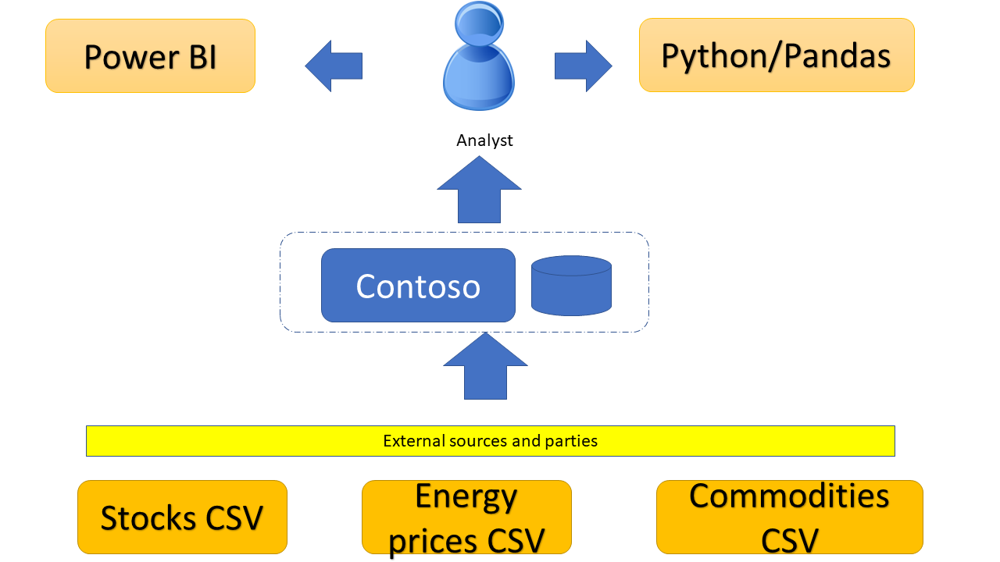

# Azure Synapse Serverless- A better approach to GIT integration and Pull Request reviews using Azure Devops
---


# Overview
**Azure Synapse** is Microsoft's data analytics solution on the cloud that significantly accelerates the time to virtualize and analyze myriad data sources. 
Synapse SQL offers both serverless and dedicated resource models. The serverless model makes it easy for companies to enter the big data space with relatively small monetary comittment. The dedicated pool model allows the company to scale up massively.


In this article we describe an approach to script the deployment of **Azure Synapse Serverless** and all the neccessary SQL artifacts.
This approach was borne out of the neccessity to not only GIT integrate all the PowerShell and SQL scripts that constitute the IAC (infrastructure as code) but also have separate DEV/UAT/PROD environments. Each environment has its own Synapse serverless instance and its own storage accounts, thereby producing complete isolation.  By the end of this article we want to have a solution where we can confidently move Synapse artifacts from **DEV** to **UAT** and to **PROD**.


---
# Hypothetical business scenario
Before we go too far down the road, it is neccessary to pin down business scenario so that we are clear about the problem for which we want a solution.  Consider a company (call it **Contoso**) which collects CSV files from several external systems and vendors. These are reports of stock prices, cargo movement, commodity prices, freight prices,etc. from all over the world. Contoso has analysts which want to analyze this vast trove of data and product reports which can translate to meaningful actions.




- Lots of CSV files coming in from varous external parties and sources. 
- A data ingestion framework built on Synapse pipelines. Data is pulled in via web scraping, ftp, http, email scraping
- Each type of CSV has a dedicated container in one central stroage account
- CSV file --> picked up by pipline --> some clearn up/ETL --> dumped into specific storage account based on file name pattern
- We are going to restrict ourselves to CSV for this discussion. Can be extended to parquet
- The company has data scientists and Power BI report writers who want to query on these files using SQL and make sense of market movements


---


# you were here

---
# What does the development experience with Synapse experience look like?


1. Create a Synapse instance (Show picture or AZ command)
1. Create a SQL Database in the Serverless pool (Show SQL Statement)
1. Create a storage account and create containers (assuming that each container maps to an external table) (show pic of containers)
1. Upload skeletal CSV/PARQUET files in the storage containers
1. Create external data source(s)
1. Creat external tables which reference the external data source(s)
1. (optionally create views)
1. Write Spark code using Notebooks (optional)
1. Enable GIT integration
1. Data scientists will consume the external tables and views via client applications like Power BI/SSMS/Python data frames


**this section must come after you have discussed the business scenario**

---

# How to maintain a CI/CD structure around SQL Views in a Synapse Serverless Pool (Think - looks out of place)

[[show a picutre of 3 environments and Synapse in each of them, show arrows from dev to uat to prod]]

# Does Synapse offer out of box GIT integration ?
Yes
[[Show a screen capture of GIT check box]]

[[show a scrren capture of Script editor prompting for GIT branch
]]

---

# How does the OOB GIT integration work?
[[to be done, a block diagram helps]]

---

# What are the challenges with out of box GIT integration?
1. [[The Synapse query editor in the browser becomes your IDE]]
1. [[Restricted to Synapse artifacts only. E.g. Powershell/CLI scripts have to be dealt with via separate CI/CD]]
1. Very hard or impossible to subsitute external locations in SQL constructs like `CREATE EXTERNAL DATASOURCR`. E.g. The URL of a storage account gets hard wired. You want to dynamically change this from DEV to PROD. 
1. Poor readability of the SQL that gets generated and saved into GIT. This makes it very hard to do an effective Pull Request review
1. The automated GIT integration makes it impossible to intercept and run some integration tests. E.g. I want to be sure that my `CREATE EXTERNAL TABLE`  is producing columns with the right column data types. Talk about COSMOS views...


[[See if you can grab screen capture from Reddi about people complaining about lack of PR]]

[[find the Old MS screen capture]]

---
# Why not use SSDT to integrate the SQL scripts with GIT ?
[[Lack of SSDT support]]

---

# What does the proposed solution look like?
[we need a block diagram to show what the solution looks like]

## Pull request work flow
[[src code tree]] --> [[Developer creates a feature branch]] --> [Pull request is raised] -> [Run CI/CD and deploy using PowerShell/CLI to DEV] --> [[PR approved]] --> [[ Merge with master ]] --> [[Run CI/CD]] --> [[Deploy using PowerShell/CLI to UAT]]

::: mermaid
graph LR;
    A(src code tree)-->B(Developer creates a feature branch);
    B-->C(cool);
    C-->D(Pull request is raised);
    D-->E(Run CI/CD and deploy using PowerShell/CLI to DEV)

:::


## Source structure
[[show the detailed source tree , similar to what you did for Azure Python ]]

---

# What is in scope and out of scope of this article?
- [[No data transformation pipelines]]
- [[restricting to CSV, although solution can be extended to PARQUET and JSON]]
- We are using serverless pool. The solution can be extended to SQL server pool.
- PySpark is out of scope. 
- 
---

# Prerequisites neccessary to follow this article and run the sample code?
[[set the expectations]]
- Access to Azure subscription
- Visual Studio code
- PowerShell Core
- Running the accompanying code might incur minor Azure charges

# How to create an instance of Azure Synapse?
[[give a code snippet]]
[[create the resource group]]

# How to create the Storage account and containers ?
[[produce a code snippet]]

# How to create a Synapse serverless pool?
[[produce a code snippet]]

# How to ensure that Syanpse can access the CSV files in the storage account?
[[produce a code snippet]]

# how to create a SQL External table?
Solve this in a step by step manner

## Step 1 Create the file format
[[to be done]]

## Step 2 Create the credential to access the blob store
[[produce a code snippet]]

## Step 4 Create the external data source
[[produce a code snippet]]

## Step 5 Create the external table
[[produce a code snippet]]

## Can we test and verify the scripts locally before automating via Azure Devops?
[[absolutely , show the Power shell steps, az loing, etx.]]

---


# How to use Azure Devops to roll out the CI/CD of this solution?
[[show Azure Devops with DEV,UAT and PROD stages]]
[[show a block diagram of CI --> then CD]]


[[you will need a build.yml file]]
[[you will need a Release pipeline]]
[[you will need to run the integration tests ]]

# References
- [what is Azure Synapse?](https://docs.microsoft.com/en-us/azure/synapse-analytics/overview-what-is)
----
----
----

# References

## Query CSV

- Single file https://docs.microsoft.com/en-us/azure/synapse-analytics/sql/query-single-csv-file
- Multiple file https://docs.microsoft.com/en-us/azure/synapse-analytics/sql/query-folders-multiple-csv-files

- Support for different storage types https://docs.microsoft.com/en-us/sql/t-sql/statements/create-external-data-source-transact-sql?view=sql-server-ver16&tabs=dedicated
- Use external tables with Synapse SQL https://docs.microsoft.com/en-us/azure/synapse-analytics/sql/develop-tables-external-tables?tabs=hadoop

- Github with sample SQL from Jovan Popovich https://github.com/Azure-Samples/Synapse/blob/main/SQL/Samples/LdwSample/SampleDB.sql
- 
- 
This looks good
https://docs.microsoft.com/en-us/azure/synapse-analytics/quickstart-serverless-sql-pool#first-time-setup

## CREATE EXTERNAL DATASOURCE
- [Full documentation](https://docs.microsoft.com/en-us/sql/t-sql/statements/create-external-data-source-transact-sql?view=sql-server-ver16&tabs=dedicated)

## CREATE EXTERNAL TABLE
https://docs.microsoft.com/en-us/azure/synapse-analytics/sql/create-use-external-tables#external-table-on-a-set-of-files

## Query CSV file
https://docs.microsoft.com/en-us/azure/synapse-analytics/sql/query-single-csv-file

## Query Parquet files
https://docs.microsoft.com/en-us/azure/synapse-analytics/sql/query-parquet-files

## Generating a SAS token
https://docs.microsoft.com/en-us/cli/azure/storage/container?view=azure-cli-latest#az-storage-container-generate-sas

## Using managed identity to grant access to storage accounts
https://docs.microsoft.com/en-us/azure/synapse-analytics/sql/develop-storage-files-storage-access-control?tabs=managed-identity


YOU GOT STUFF WORKING
CREAETED A SAS TOKEN

```sql

-- https://csvstoragedemo001.blob.core.windows.net/peoples/peoples.csv
-- https://csvstoragedemo001.blob.core.windows.net/peoples

-- How do you drop the master key

CREATE MASTER KEY ENCRYPTION BY PASSWORD = 'Pass@word123'


IF EXISTS (SELECT * FROM SYS.DATABASE_SCOPED_CREDENTIALS WHERE [name] = 'PEOPLESCREDENTIAL') DROP DATABASE SCOPED CREDENTIAL PEOPLESCREDENTIAL
CREATE DATABASE SCOPED CREDENTIAL PEOPLESCREDENTIAL
WITH 
    IDENTITY = 'SHARED ACCESS SIGNATURE', 
    SECRET = 'sp=r&st=2022-04-26T21:31:27Z&se=2022-06-02T05:31:27Z&spr=https&sv=2020-08-04&sr=c&sig=nR9eVI0N5%2BZL5rL3NJGdreRKTpGrW3DN784zmJYKCz4%3D'
    
    -- sp=r&st=2022-04-26T21:31:27Z&se=2022-06-02T05:31:27Z&spr=https&sv=2020-08-04&sr=c&sig=nR9eVI0N5%2BZL5rL3NJGdreRKTpGrW3DN784zmJYKCz4%3D

DROP EXTERNAL DATA SOURCE peoplesdemo

create external data source peoplesdemo
with ( 
    location = 'https://csvstoragedemo001.blob.core.windows.net/' , 
    CREDENTIAL = PEOPLESCREDENTIAL 
    --TYPE = BLOB_STORAGE
    );


select *
from openrowset(
        bulk 'junk/peoples.csv',
        data_source = 'peoplesdemo',
        format = 'csv',
        parser_version ='2.0'
    ) as rows

```

# Check for the present of a master key
The master key is created on the MASTER database. In production scenarios the symmetric key should be placed in the key vault if not found
```sql

IF NOT EXISTS (SELECT * FROM SYS.KEY_ENCRYPTIONS ke WHERE ke.crypt_type = 'ESKM' )
BEGIN
    PRINT 'No master key found'
    CREATE MASTER KEY ENCRYPTION BY PASSWORD = 'Pass@word123'
END

```

# You were here!!


## Check for presence of external datasource
```sql
IF EXISTS (SELECT * FROM sys.external_data_sources WHERE [name]='peoplesdemo')
BEGIN
    print 'Dropping data source peoplesdemo'
    DROP EXTERNAL DATA SOURCE peoplesdemo
END
```
## Create external datasource
You cannot created a datasource unless you have a credential on the storage account
```sql
create external data source peoplesdemo
with ( 
    location = 'https://csvstoragedemo001.blob.core.windows.net/' , 
    CREDENTIAL = PEOPLESCREDENTIAL 
    --TYPE = BLOB_STORAGE
    );
```

## Create credential using SAS key
You cannot drop a CREDENTIAL if there is an external datasource referencing the credential
```sql
IF EXISTS (SELECT * FROM SYS.DATABASE_SCOPED_CREDENTIALS WHERE [name] = 'PEOPLESCREDENTIAL') DROP DATABASE SCOPED CREDENTIAL PEOPLESCREDENTIAL
CREATE DATABASE SCOPED CREDENTIAL PEOPLESCREDENTIAL
WITH 
    IDENTITY = 'SHARED ACCESS SIGNATURE', 
    SECRET = 'sp=r&st=2022-04-26T21:31:27Z&se=2022-06-02T05:31:27Z&spr=https&sv=2020-08-04&sr=c&sig=nR9eVI0N5%2BZL5rL3NJGdreRKTpGrW3DN784zmJYKCz4%3D'
    
```

# Getting the SQL query to work

## Dropping the data source
```sql
IF EXISTS (SELECT * FROM sys.external_data_sources WHERE [name]='peoplesdemo')
BEGIN
    print 'Dropping data source peoplesdemo'
    DROP EXTERNAL DATA SOURCE peoplesdemo
END

```

## Creating the data source
```sql
create external data source peoplesdemo
with ( 
    -- location = 'https://csvstoragedemo001.blob.core.windows.net/' ,  --did not work
    location = 'https://csvstoragedemo001.blob.core.windows.net/junk' ,
    CREDENTIAL = PEOPLESCREDENTIAL 
    --TYPE = BLOB_STORAGE
    );

```

## Running the query
```sql
select *
from openrowset(
        bulk '/peoples.csv',
        data_source = 'peoplesdemo',
        format = 'csv',
        parser_version ='2.0'
    ) as rows

```

## Creating the external file format
Notice the importance of **FIRST_ROW**. This specifies that the first data row is from row number 2 (1 based)
```sql
IF EXISTS (SELECT * FROM sys.external_file_formats WHERE [name]='CSVFORMAT') 
BEGIN
    DROP EXTERNAL FILE FORMAT CSVFORMAT
    PRINT 'external file format CSVFORMAT was dropped'
END
GO
CREATE EXTERNAL FILE FORMAT CSVFORMAT WITH 
    (  
        FORMAT_TYPE = DELIMITEDTEXT,
        FORMAT_OPTIONS 
            (
                FIRST_ROW=2,
                FIELD_TERMINATOR=',',
                STRING_DELIMITER='"'                
            )
    )
PRINT 'external file format CSVFORMAT was created'

```

## Create the external table
You need the **CSVFORMAT** to have been created using `CREATE EXTERNAL FILE FORMAT`

```sql
IF EXISTS (SELECT * FROM SYS.OBJECTS WHERE [name]='Peoples' AND [TYPE]='U')
BEGIN
    DROP EXTERNAL TABLE Peoples
    PRINT 'Table peoples was dropped'
END
GO
CREATE EXTERNAL TABLE Peoples (
     id int,
     --id nvarchar(20),
     firstname nvarchar(50),
     lastname nvarchar(50),
) WITH (
         LOCATION = '/peoples.csv',
         DATA_SOURCE = peoplesdemo,
         FILE_FORMAT = CSVFORMAT
);
PRINT 'Table peoples was created'
GO
SELECT * FROM Peoples

```
## Getting table schema from INFORMATION_SCHEMA

```sql
SELECT * FROM 
INFORMATION_SCHEMA.TABLES WHERE TABLE_NAME='Peoples'
GO
SELECT * FROM 
INFORMATION_SCHEMA.COLUMNS WHERE TABLE_NAME='Peoples' AND COLUMN_NAME='ID'
```

# Lessons learnt
to be consolidated

## Creating the credential
```sql
CREATE DATABASE SCOPED CREDENTIAL PEOPLESCREDENTIAL
WITH IDENTITY = 'Managed Identity';
```

## Creating the external data source
```sql
create external data source peoplesdemo
with ( 
    location = 'https://csvstoragedemo001.blob.core.windows.net/junk', 
    CREDENTIAL = PEOPLESCREDENTIAL 
    )
```

## What is the error message when Synapse does not have permissions?

```
File '/peoples.csv' cannot be opened because it does not exist or it is used by another process.
```


## How to give Synapse permissions to the storage account?
- Use the Synapse system assigned identity. No need to create one. Already there
- Assign this to the Blob contributor role
- Drop and re-create the credential


## How to get the managed identity of an Azure Resource?

```powershell
#Get the resource
$res=Get-AzResource -ResourceGroupName  $global:SynapseResourceGroup -Name $global:SynapseWorkspaceName
$res.Identity.PrincipalId

```

## Creating a file format
```sql

GO
CREATE EXTERNAL FILE FORMAT CSVFORMAT WITH 
    (  
        FORMAT_TYPE = DELIMITEDTEXT,
        FORMAT_OPTIONS 
            (
                FIELD_TERMINATOR=',',
                STRING_DELIMITER='"'                
            )
    )
GO
```
## Create external table
```sql
DROP EXTERNAL TABLE Peoples
GO
CREATE EXTERNAL TABLE Peoples (
     --int,
     id nvarchar(20),
     firstname nvarchar(50),
     lastname nvarchar(50),
) WITH (
         LOCATION = '/peoples.csv',
         DATA_SOURCE = peoplesdemo,
         --FORMAT='csv'
         FILE_FORMAT = CSVFORMAT
);

```
# What was I doing?
- Got the credential working
- Got the data source working
- Got the query to work
- Removed hard coding of storage account in data source
- Create external table is working
- Need to explore int (THI WORKS)
- YOU WERE WORKING ON CSV FILE FORMATS
- CHALLENGE
    - The Credential, Datasource and External table are all dependent. You cannot drop credential wihtout dropping Datasource and you cannot drop Datasource without dropping external table
    - Handle Credential, Datasource and External table in 1 SQL file
    - The single file should be parameterizable
    - what should be the name of the file? PeopleTable.sql
    - We already have the code for merging. See PeopleDataSource.sql
    - What do you parameterize?
    - BLOBENDPOINT
    - CONTAINERNAME
    - TABLENAME
    - Use the TABLENAME to form the credentials and external datasource
    - to keep the script simpler, try not to concatenate, use distinct tags for better readability
    - There is an emerging need for a meta-data table. Prefix with 'system' to avoid conflicts
    - The meta table should have a CSV with info about all other tables
    - Read the meta data table using PowerShell during CI
    - Read the meta data table using DataFrame via external table
- Need to create external data source
- Need to add CREATE TABLE to code
- Need to add DROP TABLE to code
- Need to add CREATE FILE FORMAT to code
- You need to create storage account , create container and upload a sample CSV file
- 
- 

# Structure of a generic table creation SQL

```sql

-- DROP THE EXTERNAL TABLE IF EXISTS
-- DROP DATA SOURCE IF EXISTS
-- DROP CREDENTIAL IF EXISTS

-- CREATE CREDENTIAL
-- CREATE DATA SOURCE
-- CREATE TABLE


--    DROP EXTERNAL TABLE
IF EXISTS (SELECT * FROM SYS.OBJECTS WHERE [name]='{{TABLENAME}}' AND [TYPE]='U')
BEGIN
    DROP EXTERNAL TABLE {{TABLENAME}}
    PRINT 'Table {{TABLENAME}} was dropped'
END
GO

--    DROP EXTERNAL DATA SOURCES
IF EXISTS (SELECT * FROM sys.external_data_sources WHERE [name]='{{DATASOURCENAME}}')
BEGIN
    print 'Dropping data source {{DATASOURCENAME}}'
    DROP EXTERNAL DATA SOURCE {{DATASOURCENAME}}
    print 'Dropped data source {{DATASOURCENAME}}'
END

--    DROP CREDENTIAL - NO NEED TO DROP CREDENTIAL BECAUSE IT IS A MANAGED IDENTITY
GO
IF EXISTS (SELECT * FROM SYS.DATABASE_SCOPED_CREDENTIALS WHERE [name] = '{{CREDENTIALNAME}}') 
BEGIN
    DROP DATABASE SCOPED CREDENTIAL {{CREDENTIALNAME}}
    PRINT 'Dropped the credential {{CREDENTIALNAME}}'
END
GO
---------------------
GO
create external data source {{DATASOURCENAME}}
with ( 
    location = '{{BLOBENDPOINT}}{{CONTAINERNAME}}', 
    CREDENTIAL = PEOPLESCREDENTIAL 
    )
PRINT 'Created external datasource peoplesdemo'

-- CREATE THE EXTERNAL TABLE
``` 

# How do you alter a file format?
I was unable to achieve. See link. It might be possible. The accompanying link from MSFT within this post is broken
https://docs.microsoft.com/en-us/answers/questions/38287/alter-external-file-format-question.html

# What was I thinking on July 16, 5 pm
 - Simplify the Table creation SQL by reducing the number of boiler plate SQL statements
 - Have a common PS file SqlHelper.ps1
 - Function `DropExternalTable -table blah`
 - Function `DropExternalDataSource -datasource blah`


```PowerShell

$sql="IF EXISTS (SELECT * FROM sys.external_data_sources WHERE [name]='PeopleDatasource') DROP EXTERNAL DATA SOURCE PeopleDatasource"
$sql="IF EXISTS (SELECT * FROM SYS.OBJECTS WHERE [name]='People' AND [TYPE]='U') DROP EXTERNAL TABLE People"
```

# References
Creating external data source in synapse and the supported data types
- https://docs.microsoft.com/en-us/sql/t-sql/statements/create-external-data-source-transact-sql?view=sql-server-ver16&tabs=dedicated
- 
