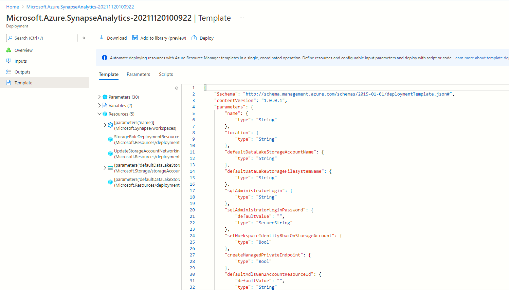

# Deploy an instance of Azure Synapse Workspace using PowerShell/ARM templates
---
# Overview
Demonstration of how to create Azure Synapse Workspace using ARM template

# How to download the ARM template from Azure Portal?
Go over the the portal and follow the steps for creating a brand new instance of Synapse Workspace. Stop short of actuall pressing the button to deploy the instance. This is where the portal gives you the option to introspect the ARM template JSON and the parameters JSON.


# How to deploy the ARM using PowerShell?
## PowerShell cmdlet
The cmdlet  `New-AzResourceGroupDeployment` can be used for deploying the ARM json file.
## How to specify the parametes?
I prefer passing a hashtable object into the `-TemplateParameterObject` parameter of the `New-AzResourceGroupDeployment` cmdlet

# How to generate a random password?
I have used a dynamically generated Guid in this demonstration. A stronger password can be generated fairly easily with some additional code.

# Where would you store the admin username/password for future reference?
A central instance of Key Vault would be the ideal location to place the password. Any downstream application which wishes to query Synapse using user name and password, should obtain the password from the key vault. With a key vault in place, you no longer need to worry about exporting the password out to another location which might compromise the confidentialy.

# How should client apps connect to Synapse workspace?
Consumer applications should avoid using the admin user name/password. Principles of least privileges must be followed. We should remember that Synapse Workspace installs a MSSQL instance. You can connect to this instance and authenticate using a JWT token.

## How to get a JWT access token?
```
Get-AzAccesstoken
```
## How to query Synapse Workspace from PowerShell using the Admin username and password?
Refer the accompanying script `querydemo.ps1`

## How to query Synapse Workspace from PowerShell using the context of the current user?
This is useful when deploying SQL views via CI/CD
```
 $token = (Get-AzAccessToken -ResourceUrl https://database.windows.net).Token

        Invoke-SqlCmd -ServerInstance "$(DatabaseServer)" `
                      -Database "$(Database)" `
                      -AccessToken "$token" `
                      -Query "<YOUR QUERY>"
```

## How to query Synapse Workspace using C#?
You would use ADO.NET. You would have to acquire a JWT token from Azure Active Directory. Example:
Refer https://docs.microsoft.com/en-us/sql/connect/ado-net/sql/azure-active-directory-authentication?view=sql-server-ver15#setting-azure-active-directory-authentication


# How to get Object ID of current user?
Refer SFO https://stackoverflow.com/questions/68300678/how-can-i-determine-whether-i-am-signed-in-with-a-user-or-service-principal-in-a

```
function Get-CurrentAzUserObjectId {
   $objectId = $null
   $ctx = Get-AzContext
   if ($ctx.Account.Type -eq "User") {
       $u = Get-AzADUser -Mail $ctx.Account.Id
       $objectId = $u.Id
   }
   else {
       $sp = Get-AzADServicePrincipal -ApplicationId $ctx.Account.Id
       $objectId = $sp.Id
   }
   return $objectId
}
```
This snippet may not give the right results when running on local workstation, depending on how `Connect-AzAccount` was invoked and whether 


# How to update the Sql admin username and password ?
See accompanying script `updateadminpassword.ps1`. 

# Sample queries
I found these useful. 
## Getting a list of all custom views
```
Invoke-Sqlcmd -Database $db -ServerInstance $server -AccessToken $token -Query "SELECT id,name FROM sys.Objects where [type]='v'"
```

## Drop a specific View
```
Invoke-Sqlcmd -Database $db -ServerInstance $server -AccessToken $token -Query "DROP VIEW vwCurrentDate"
```

